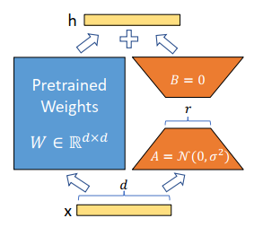
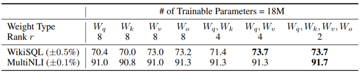
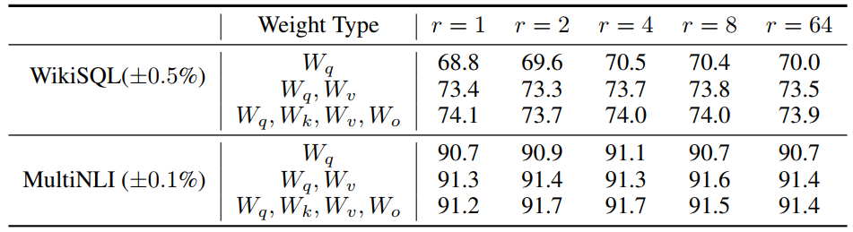
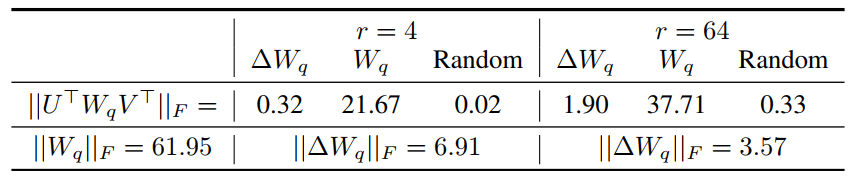
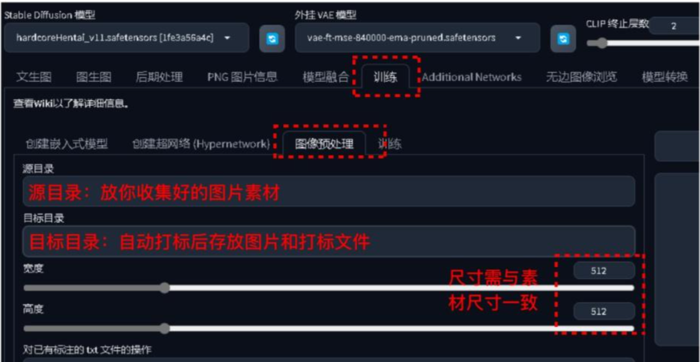
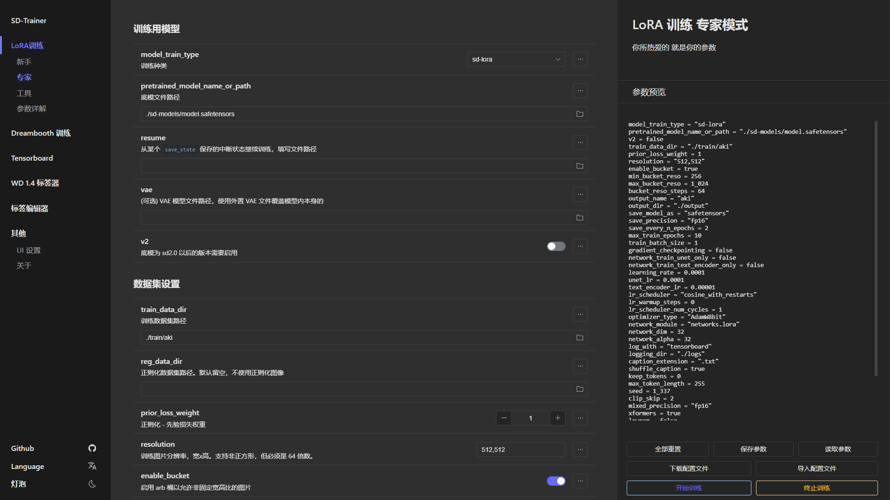
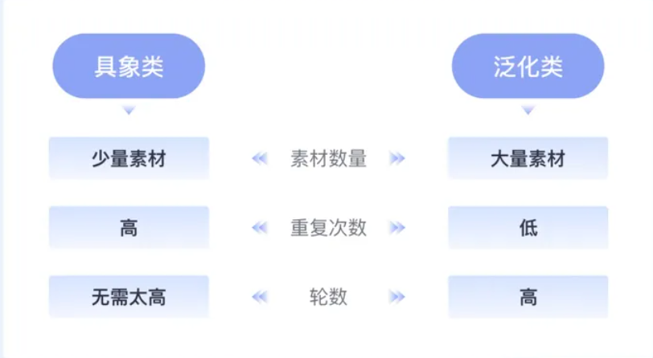
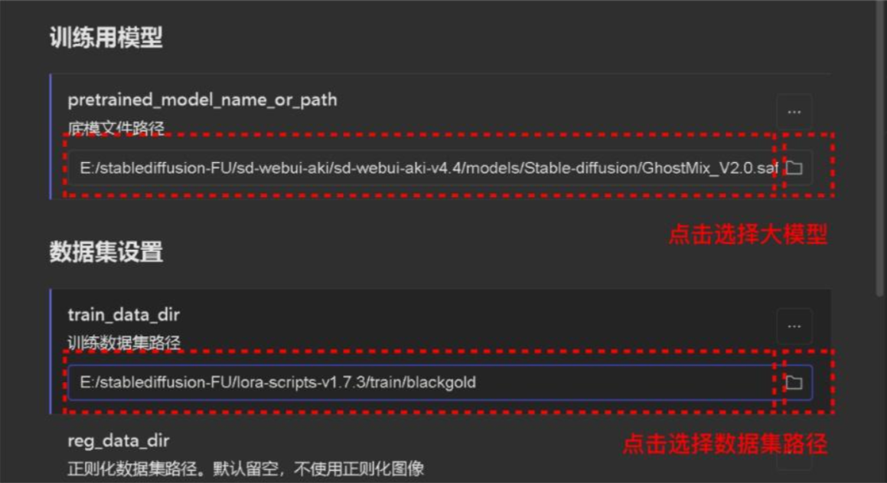
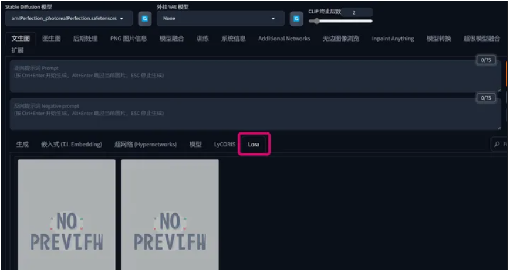

### 首先需要知道什么是LORA



**LoRA (Low-Rank Adaptation，低秩适配器)** ,这个是使用对于大语言模型的微调

### 在扩散模型中lora是怎么工作的

在扩散模型中首先我们需要知道的就是lora是作用与`Attention` 的因为lora的工作原理就是在固定原来的参数然后再加上一些参数然后进行训练公式如同下图所示
$$
\begin{equation} W_{0} + \Delta W = W_{0} + BA \qquad B\in\mathbb R^{d×r},A\in\mathbb R^{r×k} \quad and\quad r\ll min(d,k)  \end{equation}
$$
$$ W_0$$ 是原来的参数$$\Delta_0 $$就是增加的参数 lora的原理就是将$$\Delta_0$$ 分解成$$BA$$​ ，就如同`SVD`分解

#### LORA应该作用于Transformer的哪个参数矩阵？



- 显然根据上图我们可以看出如果仅通过`Lora`调整`Attention`的某一个参数矩阵效果是不好的，从上图可以看出

- 要对`Attention`的多个参数矩阵都进行调节，即使`Lora` 的矩阵的rank很低。但是也会表现出很好的效果，

- 你看上图rank 为4 但是模型表现效果比起rank 为8的然要好很多

**因此在实际操作中，应当将可微调参数分配到多种类型权重矩阵中，而不应该用更大的秩单独微调某种类型的权重矩阵。**

####  LORA最优的秩r是多少？



### 参数增量$$\Delta W$$和$$W$$的关系



- **相比于随机矩阵，**Δ𝑊**和**𝑊**有强关联**。从表中的0.32≫0.02可以看出
- Δ𝑊**仅放大了**𝑊**中任务相关的特征，并未放大头部特征**。我们知道F范数的平方等于奇异值和的平方，因此从表中的0.32≪21.67可以看出Δ𝑊和𝑊的头部奇异向量并无关联。
- **r等于4时，**Δ𝑊**的放大系数已经很大了**。计算6.91/0.32≈21.5可知Δ𝑊能将𝑊中相关的特征向量放大21.5倍。

因此我们可以得到结论：**在训练过程中，低秩的适应矩阵**$$\Delta W$$**仅仅放大了对下游任务有用的特征，而不是预训练模型中的主要特征。**

### 为什么我要使用LORA对SD进行微调

因为`StaleDiffusion`当你使用提示词而控制图像输出时，具有很多的不确定性因为预训练的大模型是来自于网络上的，他们使用了网络上特别是[danboru](https://danbooru.donmai.us/#)中的图片进行训练，预训练的大模型为了保证模型有良好的泛化性，所以当我们直接使用提示词来控制图像生成时有一定的不受控制，所以我就决定使用`Lora`来控制图像的生成可以使我得到我所需要的图像。

### 如何训练lora


1. 确认目的

   - 我们首先需要确认你需要训练什么样的模型是：人物角色、画风/风格、概念、服饰、物体/特定元素

2. 收集训练数据

   - 无论机器学习还是深度学习我们的第一步就是收集训练数据。
   - 我们需要根据我们的训练的目的收集特定的图片，因为Lora的作用是为了调整生成的图片
     - 比如如果你想要某一种风格的生成模型，那么你说收集的训练数据就需要是这种风格的
   - 图片要清晰，特征需要明显

3. 数据的处理

   

   - 统一图片的尺寸，一般都是需要统一为512x512,为什么呢，lora训练微调的大模型是所使用的训练数据也是512px，当然其他尺寸也是可以但是选择512x512 效果更好

   - 生成标签 

     - 可以使用StableDiffusionWebUI 训练部分的标签生成来进行标签处理

       

   - 优化标签

     - 上述的方法标签都是自动生成的可鞥不会满足你的要求所以你可以更改标签来达到添加触发词的目的
     - 一般的情况下你可以保留所有的标签不做为任何更改，但是这样你的Lora泛化还是会很严重（也就是意味着你需要很多精准的提示词才能触发lora
     - 所以如果你想要你的图片效果好一点应该使用删除某一些标签的做法
     - 批量修改关键词的工具BooruDatasetTagManager 可以使用这个删除

   - 调整参数训练网络上有许多的训练工具最终的原理是相同的

     - 本次使用的是

     - 重复次数（Repeat）：每一张素材的重复次数。需要在文件夹名以【数字_名称】的方式设定，如训练集chahua重复次数10，则文件夹命名为10_chahua。训练轮数（Epoch）：整个训练集按照重复次数训练一次为一轮，10轮就是10*10为每一张训练100次

       在操作过程中也同样要考虑具象类和泛化类不同来调整参数，具象类需要在每一轮提高次数以求精准度；泛化类就降低次数提高轮数，不需要那么精准，一轮轮去训练。新手训练模式下，我们只需要调整这几个参数即可。

     - 

     - 选择大模型

     - 

     - 训练数据集路径：在选择这一步之前，需要现在`sd/lora-scripts/train`这个文件夹下建一个文件夹，比如我建的叫“xiaoyuan”，再打开“chahua”文件夹在里面建一个“数字_英文名”的文件夹，将之前打标好的图和标签一起复制到“数字_英文名”的文件中（如训练`xiaoyuan`重复次数16，则文件夹命名为`16_xiaoyuan`。）

     - 修改分辨率保存设置 开始训练

### 如何下载lora

一般建议还是自己训练，因为自己训练才能够具体的控制你想要生成的图片，但是如果是下载的Lora他人的Lora不一定是满足你的要求的。

- 首先选择模型下载网站你可以从[HuggacingFace](https://huggingface.co/)下载模型后缀名一般是`safetensor`或`ckpt`或`pt`
- 因为本文所使用的的`Stable Diffusion Webui` 所以当你从网络上下载了模型文件你需要将其放置在`stable-diffusion-webui/models/Lora`
- 查看你安装的`Lora` 在SD WebUI，图生图的界面找到Lora标签卡（红框），点击后即可看到。


### 如何使用lora

- 首先你先下载或者训练好了你所需要的`lora`，训练的具体步骤可以查看上方或者网上查阅
- 首先，像平时生成图片一样，选择合适SD模型，选择采样器，编写提示词等。要使安装好`LoRA`模型产生效果，你需要书写一种特殊格式的正向提示词，格式如下：

```text
<lora: 模型名称: 影响权重>
```

示例：如果你想使用一个名称为zhi4_mix的Lora模型，并把权重设置为1，你应该把如下内容补充到正向提示词：

```text
<lora:zhi4_mix:1>
```

注意这个权重的设置是根据实际情况来进行设置

- 部分LoRA模型还需要额外加上触发词，格式如下

  ```text
  (触发词: 优先级)
  ```


### 参考

[Stable-DiffusionLoRA模型训练教程(新手篇)｜LoRA训练个人经验总结与复盘 - 知乎 (zhihu.com)](https://zhuanlan.zhihu.com/p/667165622)

[LORA微调系列(一)：LORA和它的基本原理 - 知乎 (zhihu.com)](https://zhuanlan.zhihu.com/p/646791309)
