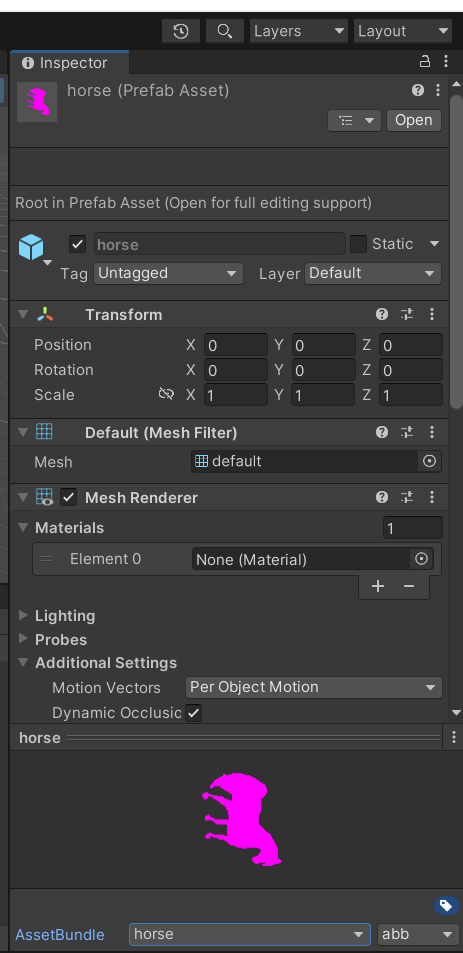
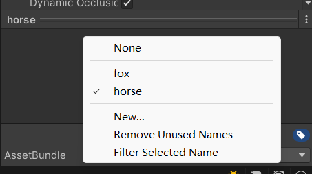
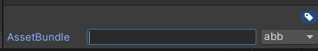
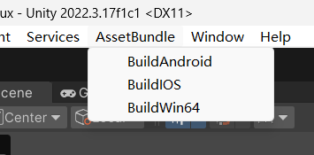

### 前言

在unity中使用`assertbundle`是一个十分常见的场景，在各种各样的方面都会遇到，但是`unity editor` 本身不提供任何的按钮为你打包`assertbundle`，但是`unity`提供`api`来帮助你，所以大家一般都是编写脚本。

### 脚本

```c#
using System.IO;
using UnityEditor;

/// <summary>
/// AssetBundleUnityEditor
/// </summary>
public class QAssetBundleEditor
{
    static string OUT_PATH_WIN64 = "AssetBundles/Win64/AssetBundles";
    static string OUT_PATH_IOS = "AssetBundles/IOS/AssetBundles";
    static string OUT_PATH_Android = "AssetBundles/Android/AssetBundles";

    /// <summary>
    /// BuildWin64
    /// </summary>
    [MenuItem("AssetBundle/BuildWin64")]
    public static void BuildAssetBundle_Win64()
    {
        BuildAssetBundles(OUT_PATH_WIN64, BuildTarget.StandaloneWindows64);
    }

    /// <summary>
    /// BuildWin64
    /// </summary>
    [MenuItem("AssetBundle/BuildIOS")]
    public static void BuildAssetBundle_IOS()
    {
        BuildAssetBundles(OUT_PATH_IOS, BuildTarget.iOS);
    }

    /// <summary>
    /// BuildWin64
    /// </summary>
    [MenuItem("AssetBundle/BuildAndroid")]
    public static void BuildAssetBundle_Android()
    {
        BuildAssetBundles(OUT_PATH_Android, BuildTarget.Android);
    }

    public static void BuildAssetBundles(string outPath, BuildTarget buildTarget)
    {
        if (Directory.Exists(outPath))
        {
            Directory.Delete(outPath, true);
        }
        Directory.CreateDirectory(outPath);
        BuildPipeline.BuildAssetBundles(outPath, BuildAssetBundleOptions.UncompressedAssetBundle, buildTarget);

        AssetDatabase.Refresh();
    }
}
```

### 注意的事项



不要忘记给你需要打包的`AssetBundle`命名如果不命名`unity`是不会打包的，`abb`是后缀名是可以不用设置的。



命名时选择`new`



输入后回车就设置名字完成。




再选择一个就好了。
