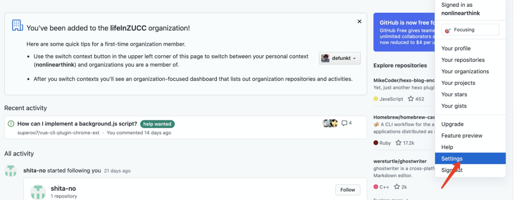
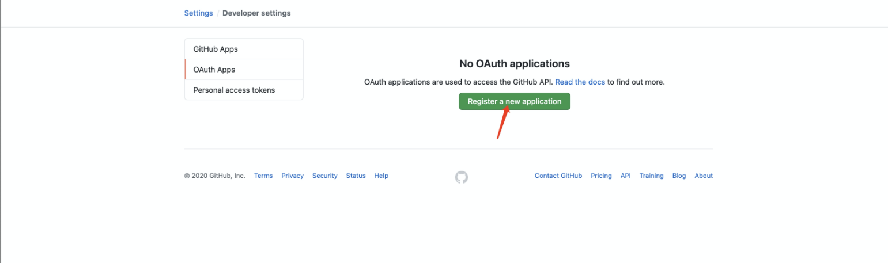
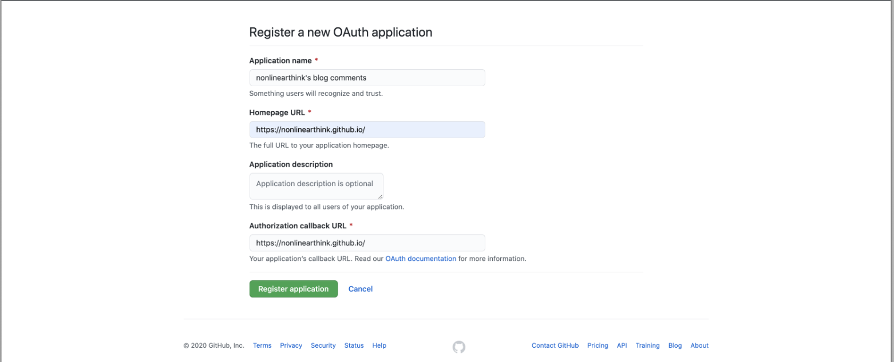
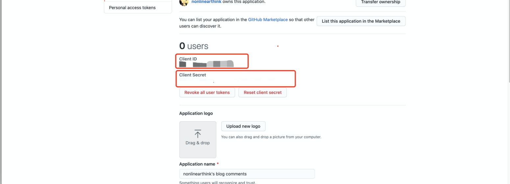

### 创建 OAuth Application
`创建 OAuth Application` 的过程所有 hexo 主题都是通用的，后面的配置文件主题之间有所差异。

首先，先跳转到 OAuth Apps 的创建界面。  
具体路径是 `Settings`\-`Developer settings`\-`OAuth Apps`。





### 点击 Register a new application，创建一个新的 OAuth Application。


以下是对这些字段的说明

| 表单字段 |  | 说明 |
| --- | --- | --- |
| Application name | 必填 | 应用名字，随便填 |
| Homepage URL | 必填 | 填写你的博客首页地址 |
| Application description | 选填 | 应用描述，随便填 |
| Authorization callback URL | 必填 | 登录 Github 账号后，要跳转回去，这个地址就是跳转回去的地址 |


填写完之后，会显示这样一个界面，其中 `Client ID` 和 `Client Secret` 很重要，待会要用，这里我防止自己的应用被滥用，就先打码了。

### 修改 butterfly 配置文件

**之前的步骤所有的 Gittalk 配置都是一样的，接下来的配置只针对 [butterfly](https://github.com/jerryc127/hexo-theme-butterfly) 主题，主题与主题之间可能有些不一样。**

打开 `_data/butterfly.yml`，找到 gittalk 的配置项。
把之前获取 `Client ID` 和 `Client Secret` 分别填到 `client_id` 和 `client_secret` 里面。

repo 填一个仓库名就好了，我这里填的就是 io 的仓库。当然，你也可以去新建一个。

owner 填自己的 github 账号名。

admin 填 repo 仓库的拥有者，hexo 解析的时候会使用 `admin/repo` 去定位仓库的位置。

> 比较容易犯错的地方是 repo 填了 `nonlinearthink/nonlinearthink.github.io` 这样的名字，注意，repo 只需要填仓库名字，不需要加拥有者，拥有者放到 admin 里面。

**关于其他的字段解释可见[官方博客](https://demo.jerryc.me/posts/ceeb73f/#%E8%A9%95%E8%AB%96)**

### 更新、发布

```sh
hexo clean 
hexo g 
hexo d
```
## gitalk踩坑之error not found

出现error not found的问题，一般来说就是GitHub仓库的链接出现了问题，笔者部署的时候就出现了这个问题，死活不知道那里配置有误。最后，笔者明察秋毫，发现竟然是我的仓库设置了private，没有公开。最后，新建public的仓库之后，问题迎刃而解，希望我踩的坑能够给大家一点启发。
