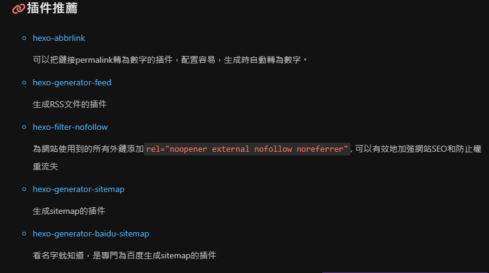

## 插件选择

根据 butterfly 主题的进阶教程里插件推荐，可以使用 [hexo-generator-feed](https://github.com/hexojs/hexo-generator-feed) 插件进行 RSS feed 的制作。



于是根据 [hexo-generator-feed](https://github.com/hexojs/hexo-generator-feed) 的官方教程，一步步进行插件配置。

## hexo 根目录安装插件并配置

1.  进入 hexo 的根目录，执行如下命令进行插件安装
```sh
npm install hexo-generator-feed --save
```
2.  根据官方建议配置 hexo 根目录的\_config.yml 文件，再\_config.yml 文件末尾添加如下配置信息

```yaml
feed:
  enable: true #是否启用插件
  type: atom #有atom和rss2两个选项，使用默认atom就好了
  path: atom.xml #也用默认配置atom.xml就行
  limit: 20 #展示文章的数量,使用 0 或 false 代表展示全部
  hub: #这个我没用上，根据官网，空着就行
  content: #默认是false，true的话会在rss文件中包含整个文章内容
  content_limit: 140 #摘要长度
  content_limit_delim: ' ' #没看明白官方的意思，就跟着默认不填了
  order_by: -date #采用日期进行排序
  icon: icon.png #给rss链接配置icon
  autodiscovery: true #自动发现提要
  template: #给rss文章配置模板
```

## 主题目录配置文件

1.  在 butterfly 主题目录下的\_config.yml 文件内添加配置内容：
```yaml
rss: /atom.xml
```

2.  在\_config.yml 文件中找到 social settings 项，添加如下内容。（这样主页就能正确显示 RSS 图标了）

  ```yaml
  fas fa-rss: https://你的域名地址/atom.xml
  ```

## 大功告成

bash

```sh
hexo clean && hexo g && hexo d
```