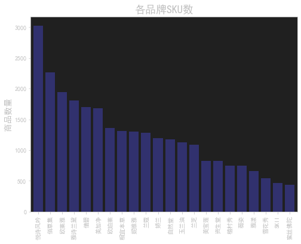
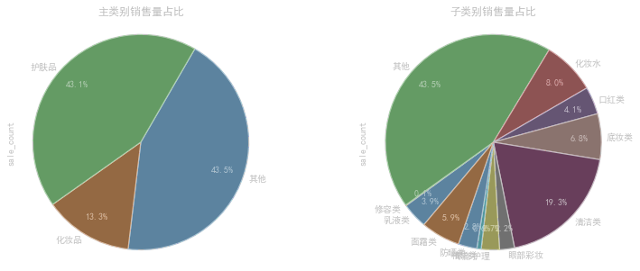
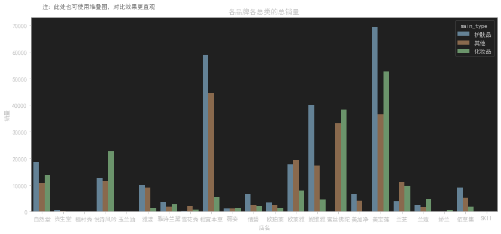
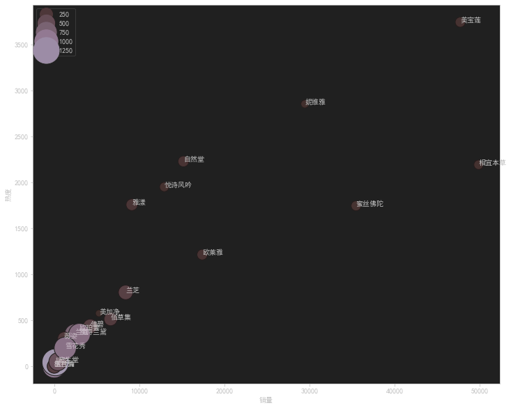
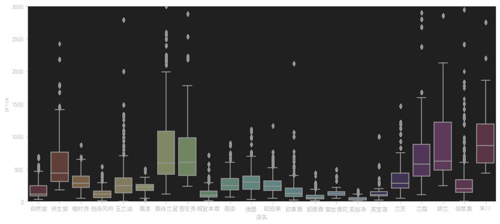
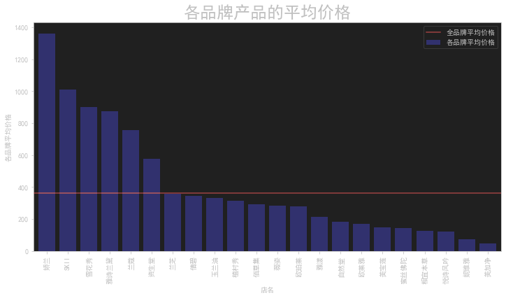
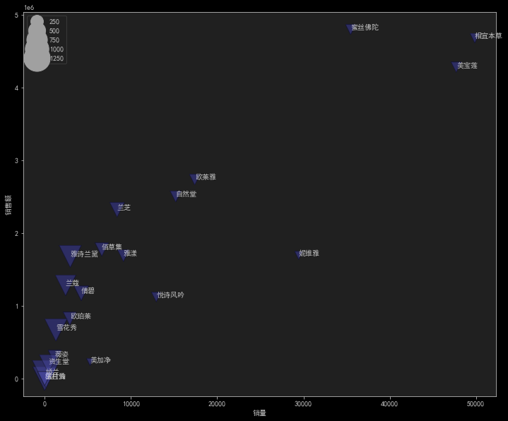
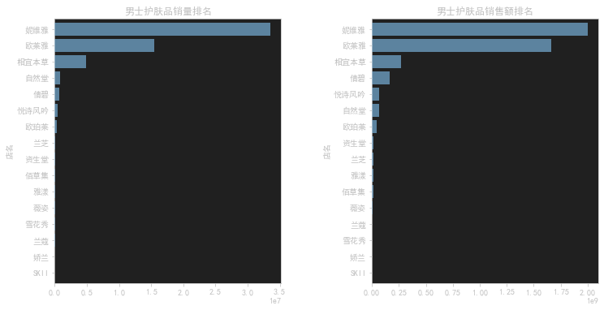
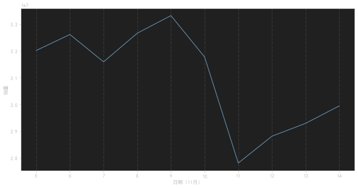

### 数据加载

```python
data = pd.read_csv('双十一淘宝美妆数据.csv')
```

使用 **pandas** 读取csv

### 数据预处理

```python
# 对重复数据做删除处理
data = data.drop_duplicates(inplace=False)
data.shape
# 此处虽然删除了重复值，但索引未变，因此应用以下方法进行重置索引
data.reset_index(inplace=True,drop=True)
# 查看缺失值
data.isnull().any()
# 查看数据结构
data.describe()
# 查看sale_count列的众数
mode_01 = data.sale_count.mode()
mode_01
# 查看comment_count列的众数
mode_02 = data.comment_count.mode()
mode_02
data = data.fillna(0)
data.isnull().sum()
```

这段代码是用于数据预处理的。下面是对每个步骤的解释：

1. ` data = data.drop_duplicates(inplace=False)`: 这行代码用于删除数据中的重复行。`drop_duplicates`函数会返回一个删除了重复行的新数据集，然后将其赋值给`data`变量。
2. ` data.shape`: 这行代码用于打印数据集的形状，即行数和列数。
3. `data.reset_index(inplace=True, drop=True)`: 这行代码用于重置数据集的索引。`reset_index`函数会重置数据集的索引，并将原来的索引作为一列添加到数据集中。`inplace=True`表示直接修改原始数据集，`drop=True`表示丢弃原来的索引列。
4. `data.isnull().any()`: 这行代码用于检查数据集中是否存在缺失值。`isnull()`函数会返回一个布尔类型的数据集，表示每个元素是否为缺失值，`any()`函数会检查每一列是否存在缺失值，并返回一个布尔值。
5. `data.describe()`: 这行代码用于生成数据集的统计描述。`describe()`函数会计算每个数值列的基本统计量，如计数、均值、标准差、最小值、25%分位数、中位数、75%分位数和最大值。
6. `mode_01 = data.sale_count.mode()`: 这行代码用于计算`sale_count`列的众数。`mode()`函数会返回一个包含众数的数据集，可能有多个众数。
7. `mode_02 = data.comment_count.mode()`: 这行代码用于计算`comment_count`列的众数，同样使用了`mode()`函数。
8. `data = data.fillna(0)`: 这行代码用于将数据集中的缺失值填充为0。`fillna(0)`函数会将所有缺失值替换为指定的值，这里使用的是0。
9. `data.isnull().sum()`: 这行代码用于计算数据集中每列的缺失值数量。`isnull().sum()`函数会返回每列缺失值的数量，通过对所有列求和得到总的缺失值数量。

这些步骤可以帮助清洗数据、处理重复值和缺失值，使数据集更适合进行后续的分析和建模。

#### 给商品名称中文分词

```python
import jieba
# jieba.load_userdict('addwords.txt')
title_cut = []
for i in data.title:
    j = jieba.lcut(i)
    title_cut.append(j)
data['item_name_cut'] = title_cut
data[['title','item_name_cut']].head()
```

这段代码使用了中文分词库jieba来对`data`中的`title`列进行分词，并将分词结果存储在`title_cut`列表中。然后，通过将`title_cut`列表赋值给`data`的新列`item_name_cut`，将分词结果添加到`data`数据集中。

具体的步骤如下：

1. `import jieba`: 这行代码导入了jieba库，它是一个常用的中文分词库，用于将中文文本进行分词处理。
2. `title_cut = []`: 创建一个空列表`title_cut`，用于存储分词结果。
3. `for i in data.title:`: 这行代码使用一个循环遍历`data`数据集中的每个`title`值。
4. `j = jieba.lcut(i)`: 这行代码使用jieba库的`lcut`函数对当前`title`值进行分词，返回一个分词后的列表，并将其赋值给变量`j`。
5. `title_cut.append(j)`: 这行代码将分词结果`j`添加到`title_cut`列表中。
6. `data['item_name_cut'] = title_cut`: 这行代码将`title_cut`列表赋值给`data`数据集的新列`item_name_cut`，将分词结果添加到数据集中。
7. `data[['title','item_name_cut']].head()`: 这行代码打印`data`数据集中`title`列和`item_name_cut`列的前几行数据，以检查分词结果是否正确添加到了数据集中。

**技术**通过使用中文分词库jieba，可以将中文文本进行分词处理，将连续的文本切分成有意义的词语，为后续的文本挖掘、自然语言处理等任务提供基础。

#### 给商品分类

```python
data[['title','item_name_cut']].head()

#%%

# 给商品添加分类
sub_type = []   #子类别
main_type = []  #主类别
basic_config_data = """护肤品    套装    套装
护肤品    乳液类    乳液    美白乳    润肤乳    凝乳    柔肤液'    亮肤乳    菁华乳    修护乳
护肤品    眼部护理    眼霜    眼部精华    眼膜
护肤品    面膜类    面膜
护肤品    清洁类    洗面    洁面    清洁    卸妆    洁颜    洗颜    去角质    磨砂
护肤品    化妆水    化妆水    爽肤水    柔肤水    补水露    凝露    柔肤液    精粹水    亮肤水    润肤水    保湿水    菁华水    保湿喷雾    舒缓喷雾
护肤品    面霜类    面霜    日霜    晚霜    柔肤霜    滋润霜    保湿霜    凝霜    日间霜    晚间霜    乳霜    修护霜    亮肤霜    底霜    菁华霜
护肤品    精华类    精华液    精华水    精华露    精华素
护肤品    防晒类    防晒霜    防晒喷雾
化妆品    口红类    唇釉    口红    唇彩
化妆品    底妆类    散粉    蜜粉    粉底液    定妆粉     气垫    粉饼    BB    CC    遮瑕    粉霜    粉底膏    粉底霜
化妆品    眼部彩妆    眉粉    染眉膏    眼线    眼影    睫毛膏
化妆品    修容类    鼻影    修容粉    高光    腮红
其他    其他    其他"""

# 将字符串basic_config_data 转为字典 category_config_map
category_config_map = {}
for config_line in basic_config_data.split('\n'):
    basic_cateogry_list = config_line.strip().strip('\n').strip('    ').split('    ')
    main_category = basic_cateogry_list[0]
    sub_category = basic_cateogry_list[1]
    unit_category_list = basic_cateogry_list[2:-1]
    for unit_category in unit_category_list:
        if unit_category and unit_category.strip().strip('    '):
            category_config_map[unit_category] = (main_category,sub_category)
            
category_config_map
```

这段代码用于给商品进行分类。具体的步骤如下：

1. `sub_type = []` 和 `main_type = []`：创建两个空列表，用于存储商品的子类别和主类别。
2. `basic_config_data = """护肤品    套装    套装 ... 其他    其他    其他"""`：定义了一个包含商品分类信息的字符串。每一行表示一个商品类别的配置，由三个部分组成，以制表符分隔：主类别、子类别、具体的子类别列表。
3. `category_config_map = {}`：创建一个空字典`category_config_map`，用于存储商品子类别与主类别的映射关系。
4. `for config_line in basic_config_data.split('\n'):`：通过对`basic_config_data`字符串按换行符进行分割，遍历每一行配置。
5. `basic_cateogry_list = config_line.strip().strip('\n').strip('    ').split('    ')`：将当前行的配置进行清理和分割，得到一个列表`basic_cateogry_list`，包含主类别、子类别和具体子类别列表。
6. `main_category = basic_cateogry_list[0]` 和 `sub_category = basic_cateogry_list[1]`：从`basic_cateogry_list`提取主类别和子类别。
7. `unit_category_list = basic_cateogry_list[2:-1]`：从`basic_cateogry_list`提取具体子类别列表。
8. `for unit_category in unit_category_list:`：遍历具体子类别列表。
9. `if unit_category and unit_category.strip().strip('    ')`：检查具体子类别是否存在且不为空。
10. `category_config_map[unit_category] = (main_category,sub_category)`：将具体子类别作为键，将主类别和子类别作为值，添加到`category_config_map`字典中，建立子类别与主类别的映射关系。
11. `category_config_map`：打印`category_config_map`字典，以检查商品子类别与主类别的映射关系是否正确添加。

通过这段代码，可以根据配置信息将商品进行分类，并将子类别和主类别存储到对应的列表中。这样的分类信息可以用于后续的商品分析、推荐系统等任务。

没用到什么特别的技术

```python
for i in range(len(data)):
    exist = False
    for temp in data.item_name_cut[i]:
        if temp in category_config_map:
            sub_type.append(category_config_map.get(temp)[1])
            main_type.append(category_config_map.get(temp)[0])
            exist = True
            break
    if not exist:
        sub_type.append('其他')
        main_type.append('其他')

print(len(sub_type),len(main_type),len(data))
```

这段代码是一个循环结构，用于将商品数据根据分类配置信息进行分类，并将分类结果存储到`sub_type`和`main_type`列表中。

具体的步骤如下：

1. `for i in range(len(data)):`：通过`for`循环遍历`data`数据的索引。
2. `exist = False`：初始化一个布尔变量`exist`，用于标记当前商品是否存在于分类配置中。
3. `for temp in data.item_name_cut[i]:`：通过`for`循环遍历当前商品的分词结果`data.item_name_cut[i]`中的每个词语。
4. `if temp in category_config_map:`：检查当前词语`temp`是否存在于分类配置字典`category_config_map`的键中。
5. `sub_type.append(category_config_map.get(temp)[1])` 和 `main_type.append(category_config_map.get(temp)[0])`：如果当前词语存在于分类配置中，将对应的子类别和主类别添加到`sub_type`和`main_type`列表中。这里使用`category_config_map.get(temp)`来获取词语对应的主类别和子类别，并使用索引`[1]`和`[0]`来提取对应的值。
6. `exist = True`：将`exist`变量设置为`True`，表示当前商品在分类配置中存在。
7. `break`：跳出当前循环，结束对当前商品的词语遍历。
8. `if not exist:`：如果当前商品在分类配置中不存在。
9. `sub_type.append('其他')` 和 `main_type.append('其他')`：将主类别和子类别都设置为'其他'，表示该商品没有匹配到任何分类配置。
10. `print(len(sub_type), len(main_type), len(data))`：打印`sub_type`、`main_type`和`data`列表的长度，以检查分类结果的正确性。

这段代码根据商品的分词结果，在分类配置字典中查找词语对应的主类别和子类别，并将分类结果存储到`sub_type`和`main_type`列表中。如果某个商品的分词结果中的词语没有匹配到任何分类配置，那么该商品将被标记为'其他'类别。最后，通过打印列表长度的方式进行检查。

也没什么特别的技术如果循环算的话

```python
data['sub_type'] = sub_type
data['main_type'] = main_type
data['sub_type'].value_counts()
data['main_type'].value_counts()
```

这段代码用于对分类结果进行统计分析，具体进行了以下操作：

1. `data['sub_type'] = sub_type` 和 `data['main_type'] = main_type`：将分类结果存储到`data`数据集的`sub_type`和`main_type`列中。通过这两行代码，将分类结果与原始数据关联起来，方便后续的分析和处理。
2. `data['sub_type'].value_counts()`：使用`value_counts()`函数对`data`数据集中的`sub_type`列进行统计，计算每个子类别出现的次数。该函数会返回一个包含子类别和对应出现次数的统计结果。
3. `data['main_type'].value_counts()`：使用`value_counts()`函数对`data`数据集中的`main_type`列进行统计，计算每个主类别出现的次数。该函数会返回一个包含主类别和对应出现次数的统计结果。

通过这段代码，可以获取商品分类结果中每个子类别和主类别的出现次数统计。这对于分析商品分类的分布情况、了解主要类别和次要类别的比例以及进行后续的数据洞察和决策都是有帮助的。

也没有什么特别技术

#### 添加是否是男的使用

```python
gender = []
for i in range(len(data)):
    if '男' in data.item_name_cut[i]:
        gender.append('是')
    elif '男士' in data.item_name_cut[i]:
        gender.append('是')
    elif '男生' in data.item_name_cut[i]:
        gender.append('是')
    else:
        gender.append('否')
        
# 将“是否男士专用”新增为一列
data['是否男士专用'] = gender
data['是否男士专用'].value_counts()
```

添加一列是不是男性专用

#### 计算销量之类的

```python
# 销售额=销售量*价格
data['销售额'] = data.sale_count*data.price
# 转换时间格式
data['update_time'] = pd.to_datetime(data['update_time'])

data['update_time']
# 将时间设置为新的index
data = data.set_index('update_time')

# 新增时间“天”为一列
data['day'] = data.index.day

# 删除中文分词的一列
del data['item_name_cut']
data.head() 
data.info()
```

1. `data['销售额'] = data.sale_count*data.price`：计算销售额，将销售量`sale_count`和价格`price`相乘，将结果存储在`销售额`列中。
2. `data['update_time'] = pd.to_datetime(data['update_time'])`：将`update_time`列的数据转换为日期时间格式，使用`pd.to_datetime()`函数进行转换。
3. `data['update_time']`：打印`update_time`列的数据，显示转换后的日期时间格式。
4. `data = data.set_index('update_time')`：将`update_time`列设置为数据集的新索引，通过`set_index()`函数实现。
5. `data['day'] = data.index.day`：新增一个名为`day`的列，用于存储日期时间索引中的天数。
6. `del data['item_name_cut']`：删除数据集中的`item_name_cut`列，通过`del`关键字实现。
7. `data.head()`：打印数据集的前几行，显示经过处理和转换后的数据。
8. `data.info()`：打印数据集的信息，包括列名、数据类型和非空值数量等。

这段代码主要用于对数据集进行预处理和转换，包括计算销售额、转换时间格式、设置新的索引、新增列、删除不需要的列等操作。这些处理和转换可以使数据集更加方便和适合进行后续的分析和计算。

技术各种数学计算

#### 保存清理好的数据

```python
# 保存清理好的数据为Excel格式
data.to_excel('clean_beautymakeup.xls',sheet_name='clean_data')
```

到这一步终于清理好数据预处理完毕

技术`pandas`的保存为excel

### 数据分析

#### sku分析

```python
import matplotlib.pyplot as plt
import seaborn as sns
%matplotlib inline

data.columns
plt.rcParams['font.sans-serif']=['SimHei']  #指定默认字体  
plt.rcParams['axes.unicode_minus']=False  #解决负号'-'显示为方块的问题

plt.figure(figsize=(8,6))
# 计算各店铺的商品数量
data['店名'].value_counts().sort_values(ascending=False).plot.bar(width=0.8,alpha=0.6,color='b')

plt.title('各品牌SKU数',fontsize=18)
plt.ylabel('商品数量',fontsize=14)
plt.show()
```

这段代码使用了`Matplotlib`和`Seaborn`库来进行**数据可视化**，主要实现了以下功能：

1. `import matplotlib.pyplot as plt` 和 `import seaborn as sns`：导入Matplotlib和Seaborn库，用于绘图和数据可视化。
2. `%matplotlib inline`：这是一个Jupyter Notebook的魔法命令，用于在Notebook中显示Matplotlib绘制的图形。
3. `data.columns`：打印数据集的列名，显示数据集中的所有列。
4. `plt.rcParams['font.sans-serif']=['SimHei']` 和 `plt.rcParams['axes.unicode_minus']=False`：设置Matplotlib的字体和解决负号显示问题的配置，其中`SimHei`是指定的中文字体。
5. `plt.figure(figsize=(8,6))`：创建一个新的图形，并指定图形的大小为8x6英寸。
6. `data['店名'].value_counts().sort_values(ascending=False).plot.bar(width=0.8,alpha=0.6,color='b')`：计算每个店铺的商品数量，并将结果按照降序绘制成柱状图。`data['店名'].value_counts()`用于计算每个店铺的商品数量，`sort_values(ascending=False)`用于按照降序排序，`plot.bar()`用于绘制柱状图，`width=0.8`指定柱子的宽度，`alpha=0.6`指定柱子的透明度，`color='b'`指定柱子的颜色为蓝色。
7. `plt.title('各品牌SKU数',fontsize=18)`：设置图形的标题为"各品牌SKU数"，并指定标题的字体大小为18。
8. `plt.ylabel('商品数量',fontsize=14)`：设置y轴的标签为"商品数量"，并指定标签的字体大小为14。
9. `plt.show()`：显示绘制的图形。

这段代码的目的是绘制一个柱状图，展示各个店铺的商品数量。通过可视化数据，可以更直观地比较不同店铺之间的SKU（库存商品单位）数量差异，帮助分析和决策。



#### 品牌销售量

```python
fig,axes = plt.subplots(1,2,figsize=(12,10))

ax1 = data.groupby('店名').sale_count.sum().sort_values(ascending=True).plot(kind='barh',ax=axes[0],width=0.6)
ax1.set_title('品牌总销售量',fontsize=12)
ax1.set_xlabel('总销售量')

ax2 = data.groupby('店名')['销售额'].sum().sort_values(ascending=True).plot(kind='barh',ax=axes[1],width=0.6)
ax2.set_title('品牌总销售额',fontsize=12)
ax2.set_xlabel('总销售额')

plt.subplots_adjust(wspace=0.4)
plt.show()
```

这段代码使用了Matplotlib库来创建一个包含两个子图的图形，主要实现了以下功能：

1. `fig,axes = plt.subplots(1,2,figsize=(12,10))`：创建一个包含1行2列的图形，指定图形的大小为12x10英寸，并将返回的图形对象存储在`fig`和`axes`变量中。

2. `ax1 = data.groupby('店名').sale_count.sum().sort_values(ascending=True).plot(kind='barh',ax=axes[0],width=0.6)`：对数据集按照店铺进行分组，计算每个店铺的总销售量，然后按照升序排序，并绘制水平条形图。`kind='barh'`指定绘图类型为水平条形图，`ax=axes[0]`指定子图的位置为第一个子图，`width=0.6`指定条形的宽度为0.6。绘制完成后，将返回的图形对象存储在`ax1`变量中。

3. `ax1.set_title('品牌总销售量',fontsize=12)`：设置第一个子图的标题为"品牌总销售量"，并指定标题的字体大小为12。

4. `ax1.set_xlabel('总销售量')`：设置第一个子图的x轴标签为"总销售量"。

5. `ax2 = data.groupby('店名')['销售额'].sum().sort_values(ascending=True).plot(kind='barh',ax=axes[1],width=0.6)`：对数据集按照店铺进行分组，计算每个店铺的总销售额，然后按照升序排序，并绘制水平条形图。`kind='barh'`指定绘图类型为水平条形图，`ax=axes[1]`指定子图的位置为第二个子图，`width=0.6`指定条形的宽度为0.6。绘制完成后，将返回的图形对象存储在`ax2`变量中。

6. `ax2.set_title('品牌总销售额',fontsize=12)`：设置第二个子图的标题为"品牌总销售额"，并指定标题的字体大小为12。

7. `ax2.set_xlabel('总销售额')`：设置第二个子图的x轴标签为"总销售额"。

8. `plt.subplots_adjust(wspace=0.4)`：调整子图之间的水平间距为0.4，以便更好地显示。

9. `plt.show()`：显示绘制的图形。

这段代码的目的是绘制两个水平条形图，分别展示每个店铺的总销售量和总销售额。通过可视化数据，可以直观地比较不同店铺之间的销售情况，帮助分析和决策。

#### 各种类占比和可视化 使用饼图

```python
fig,axes = plt.subplots(1,2,figsize=(12,5))

data1 = data.groupby('main_type')['sale_count'].sum()
ax1 = data1.plot(kind='pie',ax=axes[0],autopct='%.1f%%', # 设置百分比的格式，这里保留一位小数
pctdistance=0.8, # 设置百分比标签与圆心的距离
labels= data1.index,
labeldistance = 1.05, # 设置标签与圆心的距离
startangle = 60, # 设置饼图的初始角度
radius = 1.1, # 设置饼图的半径
counterclock = False, # 是否逆时针，这里设置为顺时针方向
wedgeprops = {'linewidth': 1.2, 'edgecolor':'k'},# 设置饼图内外边界的属性值
textprops = {'fontsize':10, 'color':'k'}, # 设置文本标签的属性值
)
ax1.set_title('主类别销售量占比',fontsize=12)

data2 = data.groupby('sub_type')['sale_count'].sum()
ax2 = data2.plot(kind='pie',ax=axes[1],autopct='%.1f%%', 
pctdistance=0.8, 
labels= data2.index,
labeldistance = 1.05,
startangle = 230, 
radius = 1.1, 
counterclock = False, 
wedgeprops = {'linewidth': 1.2, 'edgecolor':'k'},
textprops = {'fontsize':10, 'color':'k'}, 
)

ax2.set_title('子类别销售量占比',fontsize=12)

plt.subplots_adjust(wspace=0.4)
plt.show()
```

这段代码使用Matplotlib库创建了一个包含两个子图的图形，主要实现了以下功能：

fig,axes = plt.subplots(1,2,figsize=(12,5))：创建一个包含1行2列的图形，指定图形的大小为12x5英寸，并将返回的图形对象存储在fig和axes变量中。

data1 = data.groupby('main_type')['sale_count'].sum()：按照"main_type"列对数据集进行分组，计算每个主类别的销售量总和，并将结果存储在data1变量中。

ax1 = data1.plot(kind='pie',ax=axes[0],autopct='%.1f%%', pctdistance=0.8, labels=data1.index, labeldistance=1.05, startangle=60, radius=1.1, counterclock=False, wedgeprops={'linewidth': 1.2, 'edgecolor':'k'}, textprops={'fontsize':10, 'color':'k'})：绘制第一个子图，使用饼图展示每个主类别的销售量占比。kind='pie'指定绘图类型为饼图，ax=axes[0]指定子图的位置为第一个子图，autopct='%.1f%%'设置百分比的显示格式，pctdistance=0.8设置百分比标签与圆心的距离，labels=data1.index指定饼图的标签为主类别的名称，labeldistance=1.05设置标签与圆心的距离，startangle=60设置饼图的初始角度，radius=1.1设置饼图的半径，counterclock=False设置饼图的绘制方向为顺时针，wedgeprops={'linewidth': 1.2, 'edgecolor':'k'}设置饼图内外边界的属性，textprops={'fontsize':10, 'color':'k'}设置文本标签的属性。绘制完成后，将返回的图形对象存储在ax1变量中。

ax1.set_title('主类别销售量占比',fontsize=12)：设置第一个子图的标题为"主类别销售量占比"，并指定标题的字体大小为12。

data2 = data.groupby('sub_type')['sale_count'].sum()：按照"sub_type"列对数据集进行分组，计算每个子类别的销售量总和，并将结果存储在data2变量中。

ax2 = data2.plot(kind='pie',ax=axes[1],autopct='%.1f%%', pctdistance=0.8, labels=data2.index, labeldistance=1.05, startangle=230, radius=1.1, counterclock=False, wedgeprops={'linewidth': 1.2, 'edgecolor':'k'}, textprops={'fontsize':10, 'color':'k'})：绘制第二个子图，使用饼图展示每个子类别的销售量占比。参数的含义和设置方式与第一个子图类似，只是绘图数据和标题不同。绘制完成后，将返回的图形对象存储在ax2变量中。

ax2.set_title('子类别销售量占比',fontsize=12)：设置第二个子图的标题为"子类别销售量占比"，并指定标题的字体大小为12。

plt.subplots_adjust(wspace=0.4)：调整子图之间的水平间距为0.4，以便更好地显示。

plt.show()：显示绘制的图形。

这段代码的目的是绘制两个饼图，分别展示主类别和子类别的销售量占比。通过可视化数据，可以直观地了解各个类别在销售中的贡献比例，帮助分析和决策。



#### 各品牌各总类的的各种属性

##### 销量

```python
plt.figure(figsize=(14,6))
sns.barplot(x='店名',y='sale_count',hue='main_type',data=data,saturation=0.75,ci=0)
plt.title('各品牌各总类的总销量')
plt.ylabel('销量')
plt.text(0,78000,'注：此处也可使用堆叠图，对比效果更直观',
         verticalalignment='top', horizontalalignment='left',color='gray', fontsize=10)
plt.show()
```

使用`matplot`创建柱状图



##### 销售额

```python
plt.figure(figsize = (14,6))
sns.barplot( x = '店名',
y = '销售额',hue = 'main_type',data =data,saturation = 0.75,ci=0,)
plt.title('各品牌各总类的总销售额')
plt.ylabel('销售额')
plt.show()
```

重复的我就不写了

#### 各销售物品的平均评论数

```python
plt.figure(figsize = (12,6))
data.groupby('店名').comment_count.mean().sort_values(ascending=False).plot(kind='bar',width=0.8)
plt.title('各品牌商品的平均评论数')
plt.ylabel('评论数')
plt.show()
```

这段代码是用来绘制一个条形图，显示各个品牌商品的平均评论数。代码的功能如下：

1. `plt.figure(figsize=(12,6))`：设置图形的大小为12英寸宽和6英寸高，创建一个新的图形窗口。
2. `data.groupby('店名').comment_count.mean()`：对数据集 `data` 按照 '店名' 进行分组，然后计算每个组中 'comment_count' 列的平均值。这将返回一个包含各个品牌的平均评论数的 Series 对象。
3. `.sort_values(ascending=False)`：对平均评论数进行降序排序，以便条形图能够按照从高到低的顺序显示。
4. `.plot(kind='bar', width=0.8)`：以条形图的形式绘制数据。参数 `kind='bar'` 指定绘制条形图，`width=0.8` 指定条形的宽度为0.8。
5. `plt.title('各品牌商品的平均评论数')`：设置图形的标题为 '各品牌商品的平均评论数'。
6. `plt.ylabel('评论数')`：设置y轴标签为 '评论数'。
7. `plt.show()`：显示绘制的图形。

综合起来，这段代码的作用是根据给定数据集中的品牌和评论数信息，绘制一个条形图，以展示各个品牌商品的平均评论数，并按照评论数从高到低的顺序进行排序。

当然这个使用了`pandas的groupby`

#### 品牌热度的分析

```python
plt.figure(figsize=(12,10))

x = data.groupby('店名')['sale_count'].mean()
y = data.groupby('店名')['comment_count'].mean()
s = data.groupby('店名')['price'].mean()
txt = data.groupby('店名').id.count().index

sns.scatterplot(x,y,size=s,hue=s,sizes=(100,1500),data=data)

for i in range(len(txt)):
    plt.annotate(txt[i],xy=(x[i],y[i]))
    
plt.ylabel('热度')
plt.xlabel('销量')

plt.legend(loc='upper left')
plt.show()
```

这段代码是用来绘制一个散点图，以显示不同品牌商品的销量、评论数和价格之间的关系。代码的功能如下：

1. `plt.figure(figsize=(12,10))`：设置图形的大小为12英寸宽和10英寸高，创建一个新的图形窗口。
2. `x = data.groupby('店名')['sale_count'].mean()`：计算每个品牌的平均销量，并将结果存储在变量 `x` 中。
3. `y = data.groupby('店名')['comment_count'].mean()`：计算每个品牌的平均评论数，并将结果存储在变量 `y` 中。
4. `s = data.groupby('店名')['price'].mean()`：计算每个品牌的平均价格，并将结果存储在变量 `s` 中。
5. `txt = data.groupby('店名').id.count().index`：获取每个品牌的名称，并将结果存储在变量 `txt` 中。
6. `sns.scatterplot(x, y, size=s, hue=s, sizes=(100,1500), data=data)`：使用 seaborn 库的 `scatterplot` 函数绘制散点图。参数 `x` 和 `y` 分别指定 x 轴和 y 轴的数据，`size=s` 指定散点的大小与平均价格相关，`hue=s` 指定散点的颜色与平均价格相关，`sizes=(100,1500)` 指定散点的大小范围，`data=data` 指定使用的数据集。
7. `for i in range(len(txt)): plt.annotate(txt[i],xy=(x[i],y[i]))`：使用循环遍历每个品牌的名称，并在对应的散点上标注品牌名称。
8. `plt.ylabel('热度')`：设置 y 轴标签为 '热度'。
9. `plt.xlabel('销量')`：设置 x 轴标签为 '销量'。
10. `plt.legend(loc='upper left')`：显示图例，将图例放置在左上角。
11. `plt.show()`：显示绘制的图形。

综合起来，这段代码的作用是根据给定数据集中的品牌、销量、评论数和价格信息，绘制一个散点图，用于展示不同品牌商品之间的销量、评论数和价格的分布情况，并在散点上标注品牌名称。

使用了`matplot`画散点图的技术



#### 价格箱型图

```python
#查看价格的箱型图
plt.figure(figsize=(14,6))
sns.boxplot(x='店名',y='price',data=data)
plt.ylim(0,3000)#如果不限制，就不容易看清箱型，所以把Y轴刻度缩小为0-3000
plt.show()
```

这段代码是用来绘制一个箱型图，以展示不同品牌商品的价格分布情况。代码的功能如下：

1. `plt.figure(figsize=(14,6))`：设置图形的大小为14英寸宽和6英寸高，创建一个新的图形窗口。
2. `sns.boxplot(x='店名', y='price', data=data)`：使用 seaborn 库的 `boxplot` 函数绘制箱型图。参数 `x='店名'` 指定箱型图的横轴为品牌名称，`y='price'` 指定箱型图的纵轴为价格，`data=data` 指定使用的数据集。
3. `plt.ylim(0,3000)`：限制 y 轴的范围为0到3000，这样可以缩小 y 轴的刻度范围，使得箱型图更容易观察。
4. `plt.show()`：显示绘制的图形。

综合起来，这段代码的作用是根据给定数据集中的品牌和价格信息，绘制一个箱型图，用于展示不同品牌商品的价格分布情况。通过箱型图，可以看到不同品牌商品的价格的中位数、上下四分位数、异常值等统计信息，以帮助分析价格的整体分布和离群值情况。限制 y 轴范围为0到3000是为了缩小刻度范围，更好地展示箱型图的细节。

使用了一个`matplot`画箱型图



#### 个品牌的平均价格

```python
data.groupby('店名').price.sum()
avg_price=data.groupby('店名').price.sum()/data.groupby('店名').price.count()
avg_price
```

这段代码计算了每个店铺商品的平均价格。代码的功能如下：

1. `data.groupby('店名').price.sum()`：对数据集 `data` 按照 '店名' 进行分组，然后计算每个组中 'price' 列的总和。这将返回一个包含各个店铺商品价格总和的 Series 对象。
2. `avg_price = data.groupby('店名').price.sum() / data.groupby('店名').price.count()`：计算每个店铺商品的平均价格。首先，使用 `data.groupby('店名').price.sum()` 计算每个店铺商品价格的总和；然后，使用 `data.groupby('店名').price.count()` 计算每个店铺商品的数量；最后，将价格总和除以商品数量，得到每个店铺商品的平均价格。结果存储在变量 `avg_price` 中。

综合起来，这段代码的作用是根据给定数据集中的店铺和价格信息，计算每个店铺商品的平均价格，并将结果存储在变量 `avg_price` 中。

```python
fig = plt.figure(figsize=(12,6))
avg_price.sort_values(ascending=False).plot(kind='bar',width=0.8,alpha=0.6,color='b',label='各品牌平均价格')
y = data['price'].mean()
plt.axhline(y,0,5,color='r',label='全品牌平均价格')
plt.ylabel('各品牌平均价格')
plt.title('各品牌产品的平均价格',fontsize=24)
plt.legend(loc='best')
plt.show()
```

这段代码是用来绘制一个条形图，展示各个品牌产品的平均价格，并在图中添加全品牌平均价格的水平线。代码的功能如下：

1. `fig = plt.figure(figsize=(12,6))`：创建一个新的图形窗口，并设置图形的大小为12英寸宽和6英寸高。

2. `avg_price.sort_values(ascending=False).plot(kind='bar', width=0.8, alpha=0.6, color='b', label='各品牌平均价格')`：对平均价格进行降序排序，并以条形图的形式绘制数据。参数 `kind='bar'` 指定绘制条形图，`width=0.8` 指定条形的宽度为0.8，`alpha=0.6` 指定条形的透明度为0.6，`color='b'` 指定条形的颜色为蓝色，`label='各品牌平均价格'` 指定图例标签为'各品牌平均价格'。

3. `y = data['price'].mean()`：计算全品牌的平均价格，并将结果存储在变量 `y` 中。

4. `plt.axhline(y, 0, 5, color='r', label='全品牌平均价格')`：在图中添加一条水平线，表示全品牌平均价格。`y` 参数指定水平线的 y 坐标，`0` 和 `5` 参数指定水平线的起始和结束位置，`color='r'` 指定水平线的颜色为红色，`label='全品牌平均价格'` 指定图例标签为'全品牌平均价格'。

5. `plt.ylabel('各品牌平均价格')`：设置 y 轴标签为'各品牌平均价格'。

6. `plt.title('各品牌产品的平均价格', fontsize=24)`：设置图形的标题为'各品牌产品的平均价格'，并指定标题的字体大小为24。

7. `plt.legend(loc='best')`：显示图例，并将图例放置在最佳位置。

8. `plt.show()`：显示绘制的图形。

综合起来，这段代码的作用是根据给定数据集中的品牌和价格信息，绘制一个条形图，显示各个品牌产品的平均价格，并在图中添加全品牌平均价格的水平线。图形还包括标签、标题和图例等元素，以增强可读性。



#### 销量价格之间关系

```python
plt.figure(figsize=(12,10))

x = data.groupby('店名')['sale_count'].mean()
y = data.groupby('店名')['销售额'].mean()
s = avg_price
txt = data.groupby('店名').id.count().index

sns.scatterplot(x,y,size=s,sizes=(100,1500),marker='v',alpha=0.5,color='b',data=data)

for i in range(len(txt)):
    plt.annotate(txt[i],xy=(x[i],y[i]),xytext = (x[i]+0.2, y[i]+0.2))  #在散点后面增加品牌信息的标签
    
plt.ylabel('销售额')
plt.xlabel('销量')

plt.legend(loc='upper left')
plt.show()
```

这段代码是用来绘制一个散点图，展示不同店铺的销售额和销量之间的关系，并在散点图上添加店铺名称的标签。代码的功能如下：

1. `plt.figure(figsize=(12,10))`：创建一个新的图形窗口，并设置图形的大小为12英寸宽和10英寸高。
2. `x = data.groupby('店名')['sale_count'].mean()`：计算每个店铺的销量的平均值，并将结果存储在变量 `x` 中。
3. `y = data.groupby('店名')['销售额'].mean()`：计算每个店铺的销售额的平均值，并将结果存储在变量 `y` 中。
4. `s = avg_price`：将之前计算得到的平均价格存储在变量 `s` 中，用于设置散点的大小。
5. `txt = data.groupby('店名').id.count().index`：获取每个店铺的名称，并将结果存储在变量 `txt` 中。
6. `sns.scatterplot(x, y, size=s, sizes=(100,1500), marker='v', alpha=0.5, color='b', data=data)`：使用 seaborn 库的 `scatterplot` 函数绘制散点图。参数 `x` 指定散点的 x 坐标为销量的平均值，`y` 指定散点的 y 坐标为销售额的平均值，`size=s` 指定散点的大小为平均价格，`sizes=(100,1500)` 指定散点的大小范围为100到1500，`marker='v'` 指定散点的形状为倒三角形，`alpha=0.5` 指定散点的透明度为0.5，`color='b'` 指定散点的颜色为蓝色，`data=data` 指定使用的数据集。
7. `for i in range(len(txt)):`：遍历每个店铺的名称。
8. `plt.annotate(txt[i], xy=(x[i], y[i]), xytext=(x[i]+0.2, y[i]+0.2))`：在散点后面添加店铺名称的标签。参数 `txt[i]` 指定标签的文本为店铺名称，`xy=(x[i], y[i])` 指定标签的位置为对应的散点坐标，`xytext=(x[i]+0.2, y[i]+0.2)` 指定标签文本的位置偏移量。
9. `plt.ylabel('销售额')`：设置 y 轴标签为'销售额'。
10. `plt.xlabel('销量')`：设置 x 轴标签为'销量'。
11. `plt.legend(loc='upper left')`：显示图例，并将图例放置在左上角。
12. `plt.show()`：显示绘制的图形。

综合起来，这段代码的作用是根据给定数据集中的店铺的销量和销售额信息，绘制一个散点图，显示销售额和销量之间的关系，并在散点图上添加店铺名称的标签。图形还包括标签、标题和图例等元素，以增强可读性。



#### 男生的销量与销售额

```python
f,[ax1,ax2]=plt.subplots(1,2,figsize=(12,6))
gender_data.groupby('店名').sale_count.sum().sort_values(ascending=True).plot(kind='barh',width=0.8,ax=ax1)
ax1.set_title('男士护肤品销量排名')

gender_data.groupby('店名').销售额.sum().sort_values(ascending=True).plot(kind='barh',width=0.8,ax=ax2)
ax2.set_title('男士护肤品销售额排名')

plt.subplots_adjust(wspace=0.4)
plt.show()
```

这段代码是用来绘制一个包含两个水平条形图的子图，分别展示男士护肤品销量和销售额的排名。代码的功能如下：

1. `f, [ax1, ax2] = plt.subplots(1, 2, figsize=(12, 6))`：创建一个包含两个子图的图形窗口。参数 `1, 2` 指定子图的布局为1行2列，`figsize=(12, 6)` 指定图形的大小为12英寸宽和6英寸高。并将子图对象分别存储在 `ax1` 和 `ax2` 变量中。
2. `gender_data.groupby('店名').sale_count.sum().sort_values(ascending=True).plot(kind='barh', width=0.8, ax=ax1)`：对男士护肤品的销量数据进行分组，计算每个店铺的销量总和，并按照升序排序。然后以水平条形图的形式绘制数据，并将图形绘制在第一个子图 `ax1` 上。参数 `kind='barh'` 指定绘制水平条形图，`width=0.8` 指定条形的宽度为0.8。
3. `ax1.set_title('男士护肤品销量排名')`：设置第一个子图的标题为'男士护肤品销量排名'。
4. `gender_data.groupby('店名').销售额.sum().sort_values(ascending=True).plot(kind='barh', width=0.8, ax=ax2)`：对男士护肤品的销售额数据进行分组，计算每个店铺的销售额总和，并按照升序排序。然后以水平条形图的形式绘制数据，并将图形绘制在第二个子图 `ax2` 上。
5. `ax2.set_title('男士护肤品销售额排名')`：设置第二个子图的标题为'男士护肤品销售额排名'。
6. `plt.subplots_adjust(wspace=0.4)`：调整两个子图之间的水平间距为0.4。
7. `plt.show()`：显示绘制的图形。

综合起来，这段代码的作用是根据给定数据集中的男士护肤品的销量和销售额信息，绘制两个水平条形图的子图，分别展示男士护肤品销量和销售额的排名，并在图形中添加标题。同时通过调整子图之间的间距来改善布局。最后显示绘制的图形。



#### 销量随时间的变化的变化

```python
from matplotlib.pyplot import MultipleLocator
plt.figure(figsize = (12,6))
day_sale=data.groupby('day')['sale_count'].sum()
day_sale.plot()
plt.grid(linestyle="-.",color="gray",axis="x",alpha=0.5)
x_major_locator=MultipleLocator(1)  #把x轴的刻度间隔设置为1，并存在变量里
ax=plt.gca()  #ax为两条坐标轴的实例
ax.xaxis.set_major_locator(x_major_locator)
#把x轴的主刻度设置为1的倍数
plt.xlabel('日期（11月）')
plt.ylabel('销量')
plt.show()
```

这段代码是用来绘制一个折线图，展示每天的销售量随时间的变化情况，并对图形进行一些样式设置。代码的功能如下：

1. `plt.figure(figsize=(12, 6))`：创建一个新的图形窗口，并设置图形的大小为12英寸宽和6英寸高。

2. `day_sale = data.groupby('day')['sale_count'].sum()`：对数据集按照日期进行分组，并计算每天销售量的总和，并将结果存储在变量 `day_sale` 中。

3. `day_sale.plot()`：以折线图的形式绘制每天销售量的变化情况。

4. `plt.grid(linestyle="-.", color="gray", axis="x", alpha=0.5)`：添加网格线到图形中。参数 `linestyle="-."` 指定网格线的样式为虚线，`color="gray"` 指定网格线的颜色为灰色，`axis="x"` 指定只在 x 轴上显示网格线，`alpha=0.5` 指定网格线的透明度为0.5。

5. `x_major_locator = MultipleLocator(1)`：创建一个 `MultipleLocator` 对象，用于设置 x 轴主刻度的间隔为1。这样可以确保 x 轴上的刻度显示为整数。

6. `ax = plt.gca()`：获取当前图形的坐标轴对象。

7. `ax.xaxis.set_major_locator(x_major_locator)`：将 x 轴的主刻度设置为 `x_major_locator` 对象指定的刻度间隔，即每隔1个单位显示一个刻度。

8. `plt.xlabel('日期（11月）')`：设置 x 轴的标签为'日期（11月）'。

9. `plt.ylabel('销量')`：设置 y 轴的标签为'销量'。

10. `plt.show()`：显示绘制的图形。

综合起来，这段代码的作用是根据给定数据集中每天的销售量数据，绘制一个折线图，展示销售量随时间的变化情况，并对图形进行一些样式设置，如添加网格线、设置坐标轴刻度和标签等。最后显示绘制的图形。


