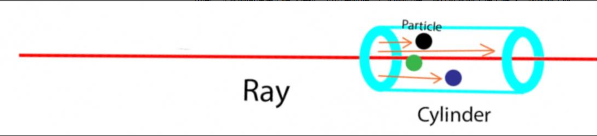

### NERF的数学原理

`nerf`简单的来讲就是，或者说其中的核心逻辑就是`camera pose`作为输入，`real image`作为输出监督，从而得到一个场景的隐式表示。

但是想要进一步学习，**理解NeRF中的渲染公式为什么长下面这个样子？黎曼和的形式是如何推导出来的？**
$$
C(\mathbf{r})=\int_{t_n}^{t_f} T(t) \sigma(\mathbf{r}(t)) \mathbf{c}(\mathbf{r}(t), \mathbf{d}) d t, \text { where } T(t)=\exp \left(-\int_{t_n}^t \sigma(\mathbf{r}(s)) d s\right)
$$

#### NeRF核心思想

在自然的生物中我们人眼是通过人眼输入的图像，经历神经网络层之后获得关于物体的3d模型的概念，`nerf`所希望的应用就是模拟人眼的视觉处理。

NERF算法的训练过程可以分为两个主要阶段：网络预训练和渲染器训练。下面是这两个阶段的详细说明：

1. 网络预训练（Network Pretraining）
   - 数据准备：首先，需要准备一个包含多个视角图像和对应的相机参数的训练数据集。这些图像可以通过在真实世界场景中拍摄或使用计算机生成技术生成。当然也可以使用`3d软件`渲染的图片。或者自己写个渲染器来满足自己的要求
   - 网络架构：NERF使用一个深度神经网络来表示场景的三维几何和光照属性。这个网络被称为编码器（Encoder），其实也就是一个多层感知机，在最初的`NERF`中只是单纯的深度神经网络，它将相机参数和图像坐标作为输入，并输出一个表示场景属性的向量。
   - 监督训练：在网络预训练阶段，使用监督学习的方法来训练编码器网络。通过最小化网络输出和真实场景属性之间的损失函数（如均方误差，也可以是交叉熵看如何理解数据），来优化网络参数。这个损失函数可以度量生成图像与真实图像之间的差异。
   - 优化：使用梯度下降等优化算法来更新网络参数，以最小化损失函数。
2. 渲染器训练（Renderer Training）
   - 数据准备：在网络预训练完成后，需要准备一个新的训练数据集，包含场景的多个视角图像和对应的相机参数。这些图像可以是从真实场景中拍摄的或使用计算机生成技术生成的。还是可以由软件模拟生成。
   - 渲染器架构：NERF使用另一个深度神经网络作为渲染器（Renderer），它接受场景的编码器表示作为输入，并输出场景的光线颜色。渲染器的目标是生成逼真的场景渲染结果。
   - 自监督训练：在渲染器训练阶段，使用自监督学习的方法来训练渲染器网络。自监督学习通过最小化渲染结果与真实图像之间的损失函数来优化网络参数。这个损失函数可以度量生成图像与真实图像之间的差异。
   - 优化：使用梯度下降等优化算法来更新渲染器网络参数，以最小化损失函数。

通过这两个阶段的训练，NERF算法可以学习到场景的三维几何形状和光照属性，并能够生成逼真的场景渲染结果。需要注意的是，NERF算法的训练需要大量的计算资源和时间，以便能够处理复杂的场景和生成高质量的渲染结果。

#### 体渲染公式

通俗来说，该点的像素计算方法为：从相机光心发出一条射线（camera ray）经过该像素坐标，途径三维场景很多点，这些“途径点”或称作“采样点”的某种累加决定了该像素的最终颜色。直观地展现了这个过程，也被称作**“体渲染”**。

数学上，它的颜色由下面的“体渲染公式”计算而出，其中  $$ c $$ 表示颜色， $$\sigma$$ 表示密度， $$r$$和 $$d$$ 分别表示camera ray上的距离和ray上的方向， $$t$$ 表示在camera ray上采样点离相机光心的距离。
$$
C(\mathbf{r})=\int_{t_n}^{t_f} T(t) \sigma(\mathbf{r}(t)) \mathbf{c}(\mathbf{r}(t), \mathbf{d}) d t, \text { where } T(t)=\exp \left(-\int_{t_n}^t \sigma(\mathbf{r}(s)) d s\right)
$$

**那我们如何知道得出这一个公式**

首先如同在编写渲染器的时候一样，我们会对光线进行一个简单的处理就是我们会会将认为光线是从眼睛中所发出的，这种做法基于的理论是光线是可逆的，在光线追踪的渲染器上这个减少了巨大的计算压力。

在体渲染中这个想法也是被应用上去光路是可逆的。所以在计算像素平面某点的像素值时，一般都通过相机发出射线来采样空间中的点并计算它们颜色的某种累加。

过程是：

1. 首先逆向计算出路径
2. 从各个光源带上光源的颜色从各个光线路径沿路径进行积分
3. 在相机将各个光线叠加

假设一条光的Ray，Ray上的光照强度为$$I(s)$$ ，其中 $$s$$ 表示Ray上的位置。考虑Ray上极小的一段路径（圆柱体），其初始位置为 $$s$$ ，长度为 $$\Delta s \rightarrow 0$$，圆柱体的底面面积为 $$E$$，内部粒子密度为 $$\rho(s)$$ ，其中的粒子都是都是半径为 $$r$$​ 的小球。

如下图所示，红色的箭头表示从相机光心发出去的光线，蓝色的圆柱体为粒子碰撞，光发生吸收、反射的区域，多种颜色的小球为粒子，橙色的小箭头为实际光线的路径（注意到碰撞到小球的光线停下）。

碰到粒子的光都会被吸收或者反射，所以计算光被吸收的概率，就可以知道有多少光能够通过该段路径。因为 $$\Delta s \rightarrow 0  $$，粒子可以被近似当作平铺在圆柱体内部，粒子所占用的面积等于粒子数量 $$E \Delta s \rho(s)   $$ 乘以粒子的截面面积 $$\pi r^2$$ ，粒子所占用的面积比上总的圆柱体底面积为：
$$
\frac{E \Delta s \rho(s) \pi r^2}{E}=\Delta s \rho(s) \pi r^2 
$$
意味着，光通过这段路径之后，光照强度变为：$$ I(s+\Delta s)=(1-\Delta s \rho(s) \pi r^2) I(s)$$​

光强度的变化量为：$$\Delta I=I(s+\Delta s)-I(s)=-\Delta s \rho(s) \pi r^2 I(s)$$

记$$-\rho(s) \pi r^2$$ ,则上述微分方程的解是：$$ I(s)=I(0) e^{\int_0^s-\sigma(t) d t} $$

上述式子中，记$$T(s)=e^{\int_0^s-\sigma(t) d t} $$

其中$$T(s)=e^{\int_0^s-\sigma(t) d t} $$,则有$$I(s)=I(0) T(s) $$​

其中这里的$$T(s)$$的物理意义就是透明度，表示当光线到到$$s$$​处的时候，光强的保留的幅度，从通俗的来将就是透过去多少光。

于是，记 $$F(s)=1-T(s) $$表示不透明度，表示当光线到达$$s$$处时，光线反射的幅度。我们可以近似认为 $$s$$ 处的粒子颜色都为 $$c(s)$$ (其实也可以说是s处光线颜色为c)，则最终的颜色输出可以表示为：$$E(c)=\int_0^{\infty} F^{\prime}(s) c(s) d s $$​

展开之后为：$$E(c)=\int_0^{\infty} T(s) \sigma(s) c(s) d s $$

这个式子就和==NeRF pape==r里面的式子长得非常相似了。一方面，`NeRF`将 $$\sigma(s) $$ 密度建模为一个仅和采样点三维坐标相关的量，将 $$c(s)$$颜色建模成一个和采样点三维坐标以及相机光线方向都有关的量；另外一方面，在实际计算的时候，往往会选择Ray上一个最近的点、一个最远的点，只计算两点之间的粒子对最终颜色的贡献。根据上述两个方面便可得到NeRF的最终公式。

#### 黎曼和形式推导

上面的公式是无法应用于神经网络来进行实现的，换句话说，上述的积分形式是无法直接代码实现的，需要转化为黎曼求和的形式。

假设我们把采样的最近端和最远端设置成，将其划分成 $$N$$个小区间，那么第 $$i$$个区间在Ray上的位置就是 $$\left[t_n+\frac{i-1}{N}\left(t_f-t_n\right), t_n+\frac{i}{N}\left(t_f-t_n\right)\right]$$。该小区间的积分可以表示为：
$$
\begin{aligned} C(\mathbf{r})_i &=\int_{t_i}^{t_{i+1}} T(t) \sigma(\mathbf{r}(t)) \mathbf{c}(\mathbf{r}(t), \mathbf{d}) \mathrm{d} t \\ &=\int_{t_i}^{t_{i+1}} \exp \left(-\int_{t_n}^t \sigma(s) \mathrm{d} s\right) \sigma_i \mathbf{c}_i \mathrm{~d} t \end{aligned} 
$$
这个函数中，密度 $$\sigma(\mathbf{r}(t))$$ 和颜色 $$\mathbf{c}(\mathbf{r}(t), \mathbf{d})$$ 都可以在这个小区间内近似为常数，直接由MLP的输出来确定。而 𝑇(𝑡) 的值相对于小区间不能忽略，所以进一步简化上式，得到：
$$
\begin{aligned} C(\mathbf{r})_i &=\sigma_i \mathbf{c}_i \int_{t_i}^{t_{i+1}} \exp \left(-\int_{t_n}^t \sigma(s) \mathrm{d} s\right) \mathrm{d} t \\ &=\sigma_i \mathbf{c}_i \int_{t_i}^{t_{i+1}} \exp \left(-\int_{t_n}^{t_i} \sigma(s) \mathrm{d} s\right) \exp \left(-\int_{t_i}^t \sigma(s) \mathrm{d} s\right) \mathrm{d} t \\ &=\sigma_i \mathbf{c}_i T_i \int_{t_i}^{t_{i+1}} \exp \left(-\int_{t_i}^t \sigma(s) \mathrm{d} s\right) \mathrm{d} t \end{aligned}
$$

$$
T_i=\exp \left(-\int_{t_n}^{t_i} \sigma(s)\right) \mathrm{d} s
$$

其中的嵌套积分项可以直接求解出来结果，得到：
$$
\exp \left(-\int_{t_i}^t \sigma(s)\right) \mathrm{d} s=\exp \left(-\sigma_i\left(t-t_i\right)\right)
$$
从而有下式，其中$$\delta_i=t_i-t_{i-1} $$ 表示小区间的长度
$$
\begin{aligned} C(\mathbf{r})_i &=\left.\sigma_i \mathbf{c}_i T_i \cdot \frac{e^{-\sigma_i\left(t-t_i\right)}}{-\sigma_i}\right|_{t_i} ^{t_{i+1}} \\ &=\mathbf{c}_i T_i\left(1-e^{-\sigma_i \delta_i}\right) \end{aligned}
$$
在区间上进行求合，得到最终的黎曼和形式:
$$
C(\mathbf{r})=\sum_{i=1}^N \mathbf{c}_i T_i\left(1-e^{-\sigma_i \delta_i}\right), T_i=\exp \left(-\sum_{j=1}^{i-1} \sigma_i \delta_i\right) 
$$

### 

参考[“图形学小白”友好的NeRF原理透彻讲解 - 知乎 (zhihu.com)](https://zhuanlan.zhihu.com/p/574351707)

