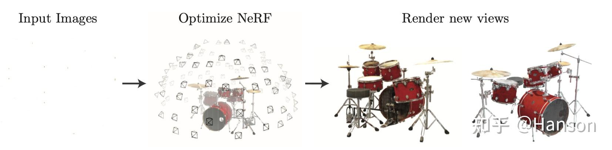
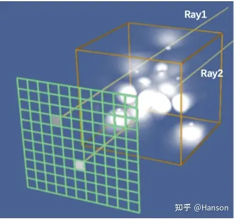

### NERF的数学原理

`nerf`简单的来讲就是，或者说其中的核心逻辑就是`camera pose`作为输入，`real image`作为输出监督，从而得到一个场景的隐式表示。

但是想要进一步学习，**理解NeRF中的渲染公式为什么长下面这个样子？黎曼和的形式是如何推导出来的？**
$$
C(\mathbf{r})=\int_{t_n}^{t_f} T(t) \sigma(\mathbf{r}(t)) \mathbf{c}(\mathbf{r}(t), \mathbf{d}) d t, \text { where } T(t)=\exp \left(-\int_{t_n}^t \sigma(\mathbf{r}(s)) d s\right)
$$

#### NeRF核心思想

核心思想受到生物神经网络的启发认为人获取图像的概念就是通过输入自己所在的位置得到限速的过程而我们认为多层感知机可以完成这一步。

我认为是一种力大飞砖。

人眼或者相机观察三维场景的过程是，给定一个相机的`pose`（位置和旋转），根据三维场景参数，可以**渲染**得到一张投影图片。NeRF实现的其实就是这样的一个过程，将三维场景用MLP(多层感知机)表示，前向的网络计算就和人眼或者相机观察三维场景的过程一致，当整个计算过程都可微的时候，通过**渲染图片**的监督，便可以对MLP进行优化，“学”出三维场景的“隐式”参数，如下图所示。

其实就是

#### 体渲染公式

若通过给定pose，从NeRF的模型中获得一张输出图片，关键就是获得每一个图片每一个像素坐标的像素值。在NeRF的paper中，给定一个camera pose，要计算某个像素坐标 (𝑥,𝑦) 的像素。通俗来说，该点的像素计算方法为：从相机光心发出一条射线（camera ray）经过该像素坐标，途径三维场景很多点，这些“途径点”或称作“采样点”的某种累加决定了该像素的最终颜色。[下图](https://link.zhihu.com/?target=https%3A//kitware.github.io/vtk-examples/site/VTKBook/07Chapter7/)直观地展现了这个过程，也被称作**“体渲染”**。

如图

#### 黎曼和形式推导

### NERF的技术原理

