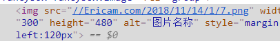
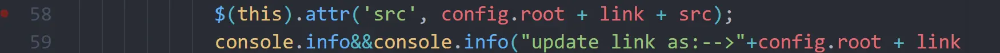
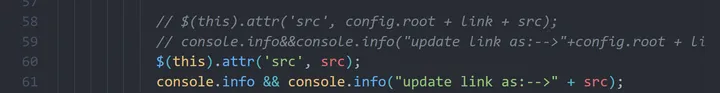

### 问题描述

> 在编写markdown中我们发现图片的链接被转化为据对路径，这导致完全无法引用  
>
> 资源文件夹中的图片  
>
> 这是一个链接转化解析的问题
>
> 如图

### 解决方法

> #### 使用他人的插件
>
> `npm install https://github.com/CodeFalling/hexo-asset-image --save`
>
> 但是这个插件已经失效了所以需要修改
>
> 1. 一种是将链接转化为绝对链接
>
> > ```js
> > 'use strict';
> > var cheerio = require('cheerio');
> > 
> > // http://stackoverflow.com/questions/14480345/how-to-get-the-nth-occurrence-in-a-string
> > function getPosition(str, m, i) {
> >   return str.split(m, i).join(m).length;
> > }
> > 
> > var version = String(hexo.version).split('.');
> > hexo.extend.filter.register('after_post_render', function(data){
> >   var config = hexo.config;
> >   if(config.post_asset_folder){
> >     	var link = data.permalink;
> > 	if(version.length > 0 && Number(version[0]) == 3)
> > 	   var beginPos = getPosition(link, '/', 1) + 1;
> > 	else
> > 	   var beginPos = getPosition(link, '/', 3) + 1;
> > 	// In hexo 3.1.1, the permalink of "about" page is like ".../about/index.html".
> > 	var endPos = link.lastIndexOf('/') + 1;
> >     link = link.substring(beginPos, endPos);
> > 
> >     var toprocess = ['excerpt', 'more', 'content'];
> >     for(var i = 0; i < toprocess.length; i++){
> >       var key = toprocess[i];
> >  
> >       var $ = cheerio.load(data[key], {
> >         ignoreWhitespace: false,
> >         xmlMode: false,
> >         lowerCaseTags: false,
> >         decodeEntities: false
> >       });
> > 
> >       $('img').each(function(){
> > 		if ($(this).attr('src')){
> > 			// For windows style path, we replace '\' to '/'.
> > 			var src = $(this).attr('src').replace('\\', '/');
> > 			if(!/http[s]*.*|\/\/.*/.test(src) &&
> > 			   !/^\s*\//.test(src)) {
> > 			  // For "about" page, the first part of "src" can't be removed.
> > 			  // In addition, to support multi-level local directory.
> > 			  var linkArray = link.split('/').filter(function(elem){
> > 				return elem != '';
> > 			  });
> > 			  var srcArray = src.split('/').filter(function(elem){
> > 				return elem != '' && elem != '.';
> > 			  });
> > 			  if(srcArray.length > 1)
> > 				srcArray.shift();
> > 			  src = srcArray.join('/');
> > 			  $(this).attr('src', config.root + link + src);
> > 			  console.info&&console.info("update link as:-->"+config.root + link + src);
> > 			}
> > 		}else{
> > 			console.info&&console.info("no src attr, skipped...");
> > 			console.info&&console.info($(this));
> > 		}
> >       });
> >       data[key] = $.html();
> >     }
> >   }
> > });
> > 
> > 
> > ```
>
> 2. 是将转化为相对链接
>
> >`hexo-asset-image`，并将58、89行的
> >
> >修改为：
> >
> >```js
> >$(this).attr('src', src);
> >console.info && console.info("update link as:-->" + src);
> >```
> >
> >
>
> 3. 还有一种就是将``转化为标签外挂
>
> >```js
> >const log = require('hexo-log')({ 'debug': false, 'slient': false });
> >
> >/**
> > * md文件返回 true
> > * @param {*} data 
> > */
> >function ignore(data) {
> >    // TODO: 好奇怪，试了一下, md返回true, 但却需要忽略 取反!
> >    var source = data.source;
> >    var ext = source.substring(source.lastIndexOf('.')).toLowerCase();
> >    return ['md',].indexOf(ext) > -1;
> >}
> >
> >function action(data) {
> >    var reverseSource = data.source.split("").reverse().join("");
> >    var fileName = reverseSource.substring(3, reverseSource.indexOf("/")).split("").reverse().join("");
> >
> >    //   -->  
> >    var regExp = RegExp("!\\[(.*?)\\]\\(" + fileName + '/(.+?)\\)', "g");
> >    // hexo g
> >    data.content = data.content.replace(regExp, "","g");
> >
> >    // log.info(`hexo-asset-img: filename: ${fileName}, title: ${data.title.trim()}`);
> >    
> >    return data;
> >}
> >
> >hexo.extend.filter.register('before_post_render',(data)=>{
> >    if(!ignore(data)){
> >        action(data)
> >    }
> >}, 0);
> >```
> >
> >
