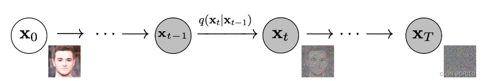
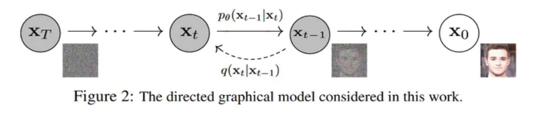

## 简介





扩散就如同它扩散的名字一样这个概念源自于热力系统。其实也就是来自于非平衡热力学。这个定义了一个扩散步骤的马可代夫链。这个链拥有两个过程一个正向过程，一个逆向过程：正向被称为扩散过程，逆向被称为你扩散过程。

正向过程是增加噪声，逆向过程是减少噪声，扩散模型经常被用于从噪声生成数据和还原数据。

### 自回归模型

你看由于是马可代夫链你会发现扩散模型其实是一个自回归的模型，自回归模型的定义如下
$$
X_t = c + \sum(\phi_i * X_{t-i}) + \theta_t
$$
扩散模型其实也是一种自回归模型

## 扩散模型的作用

就如同之前所说的扩散模型经常被用于从噪声中还原或者说是生成数据

## 扩散模型的组成

虽然说是机器学习模型但是扩散模型并不像其他机器学习算法一个有一个特定的结构或者说是网络。

其实是使用了这种通过减少噪声来还原数据的方法都可以被称为扩散模型。所以在这里我无法给出一张图具体表示扩散模型的网络架构。但是扩散模型的重点就是添加噪声，和消除噪声而这两个又是对应正向过程与逆向过程。

所以说扩散模型其实就是由正向过程和逆向过程组成的，网上能给出具体架构的一般都是指`DDPM`（Density-Dependent PixelCNN）或者是`StableDiffusion`

### 正向过程


我们一般不太关心正向过程 因为我们一般是希望使用扩散模型来从噪声来生成数据而不是将一张图片变成噪声，

但是为了便于理解我在这里还是讲解一下。

#### 添加怎样的高斯噪声

扩散模型是一个马克代夫链，正向过程的原来就是添加噪声，这个噪声是多种多样的我们就是用其中最简单的噪声高斯噪声来进行添加，当然你这里选择了高斯噪声添加，等下也需要减去一个高斯噪声。

即使我们现在锁定了高斯噪声，但是高斯噪声根据时间也是不同的那么每次添加的到底是怎么样的高斯噪声呢
$$
q(x_t|x_{t-1}) = \mathcal{N}(x_t;\sqrt{1-\beta_t}~x_{t-1},\beta_tI)
$$
我们添加这样的高斯噪声均值为$$\sqrt{1-\beta_t}~x_{t-1}$$ 方差是$$\beta_tI$$​

由于马克代夫链的性质我们可以将$$x_t$$ 与$$x_0$$​ 直接进行联系起来
$$
q(\mathbf{x}_{1:T} \vert \mathbf{x}_0) = \prod^T_{t=1} q(\mathbf{x}_t \vert \mathbf{x}_{t-1})
$$
反正经过一系列推理会得到
$$
\mathbf{x}_t  \sim q(\mathbf{x}_t \vert \mathbf{x}_0) = \mathcal{N}(\mathbf{x}_t; \sqrt{\bar{\alpha}_t} \mathbf{x}_0, (1 - \bar{\alpha}_t)\mathbf{I})
$$
具体推导可以参考[扩散模型的工作原理：从零开始的数学 - 知乎 (zhihu.com)](https://zhuanlan.zhihu.com/p/599538060)


### 逆向过程


逆向过程才是我们所关注的我们需要知道每一次减去一个什么样的噪声，其实就如同之前所说的噪声可以是各种各样的在正向过程中我们为了简单设计为高斯噪声。在这次逆向过程中我们也这么设计。

我们仍需要知道每次从$$\mathcal{N}(\textbf{0},\mathbf{I})$$​ 减去一个什么样的怎样噪声，所以为了简化处理或者说降低计算难度，我们使用参数化的高斯噪声，只需对平均值和方差进行参数化：
$$
p_\theta(\mathbf{x}_{t-1} \vert \mathbf{x}_t) = \mathcal{N}(\mathbf{x}_{t-1}; \boldsymbol{\mu}_\theta(\mathbf{x}_t, t), \boldsymbol{\Sigma}_\theta(\mathbf{x}_t, t))
$$
当然有人会说逆向扩散一定是减去一个高斯噪声吗？不一定这里如此处理仅仅是因为首先想降低计算难度，所以选择其中一种噪声。

对于逆向过程我们也可以通过数学得到其$$x_t$$ 与$$x_0$$的关系
$$
p_\theta(\mathbf{x}_{0:T}) = p_{\theta}(\mathbf{x}_T) \prod^T_{t=1} p_\theta(\mathbf{x}_{t-1} \vert \mathbf{x}_t)
$$

#### 如何训练你扩散过程

模型想要训练就需要损失函数来进行优化

可以使用平方差中之类的总之原来就是需要计算预测噪声与真实噪声的损失。

真实的噪声可以有之前的正向过程得出。
$$
Loss = LossFun（p，q）
$$
借鉴于[深入浅出扩散模型(Diffusion Model)系列：基石DDPM（源码解读篇） - 知乎 (zhihu.com)](https://zhuanlan.zhihu.com/p/655568910)

```python
class Diffusion:
    def forward(x0):
        t = torch.randint(0,T,shape,B)
        return loss(x0,t)

    def q_sample(self, x0: torch.Tensor, t: torch.Tensor, eps: Optional[torch.Tensor] = None):
        """
        Diffusion Process，根据xt所服从的高斯分布的mean和var，求出xt
        Params:
            x0：来自训练数据的干净的图片
            t：某一步time_step
        Return:
            xt: 第t时刻加完噪声的图片
        """

        # ----------------------------------------------------------------
        # xt = sqrt(alpha_bar_t) * x0 + sqrt(1-alpha_bar_t) * epsilon
        #    = mean + sqrt(var) * epsilon
        # 其中，epsilon~N(0, I)
        # ----------------------------------------------------------------
        if eps is None:
            eps = torch.randn_like(x0)
       
        mean, var = self.q_xt_x0(x0, t)
        return mean + (var ** 0.5) * eps

    def p_sample(self, xt: torch.Tensor, t: torch.Tensor):
        """
        Sampling, 当模型训练好之后，根据x_t和t，推出x_{t-1}
        Params:
            x_t：t时刻的图片
            t：某一步time_step
        Return:
            x_{t-1}: 第t-1时刻的图片
        """

        # eps_model: 训练好的UNet去噪模型
        # eps_theta: 用训练好的UNet去噪模型，预测第t步的噪声
        eps_theta = self.eps_model(xt, t)
        
        # 根据Sampling提供的公式，推导出x_{t-1}
        alpha_bar = gather(self.alpha_bar, t)       
        alpha = gather(self.alpha, t)
        eps_coef = (1 - alpha) / (1 - alpha_bar) ** .5
        mean = 1 / (alpha ** 0.5) * (xt - eps_coef * eps_theta)
        var = gather(self.sigma2, t)
        eps = torch.randn(xt.shape, device=xt.device)
 
        return mean + (var ** .5) * eps

    def loss(self, x0: torch.Tensor, noise: Optional[torch.Tensor] = None):
        """
        1. 随机抽取一个time_step t
        2. 执行diffusion process(q_sample)，随机生成噪声epsilon~N(0, I)，
           然后根据x0, t和epsilon计算xt
        3. 使用UNet去噪模型（p_sample），根据xt和t得到预测噪声epsilon_theta
        4. 计算mse_loss(epsilon, epsilon_theta)
        
        【MSE只是众多可选loss设计中的一种，大家也可以自行设计loss函数】
        
        Params:
            x0：来自训练数据的干净的图片
            noise: diffusion process中随机抽样的噪声epsilon~N(0, I)
        Return:
            loss: 真实噪声和预测噪声之间的loss         
        """
        
        batch_size = x0.shape[0]
        # 随机抽样t
        t = torch.randint(0, self.n_steps, (batch_size,), device=x0.device, dtype=torch.long)
        
        # 如果为传入噪声，则从N(0, I)中抽样噪声
        if noise is None:
            noise = torch.randn_like(x0)

        # 执行Diffusion process，计算xt
        xt = self.q_sample(x0, t, eps=noise)
        # 执行Denoise Process，得到预测的噪声epsilon_theta
        eps_theta = self.eps_model(xt, t)
        
        # 返回真实噪声和预测噪声之间的mse loss
        return F.mse_loss(noise, eps_theta)
```

扩散模型的训练步骤

1. 随机抽取一个time_step t
1. 执行diffusion process(q_sample)，随机生成噪声epsilon~N(0, I)，然后根据x0, t和epsilon计xt
2. 3. 使用UNet去噪模型（p_sample），根据xt和t得到预测噪声epsilon_theta
4. 计算mse_loss(epsilon, epsilon_theta)

