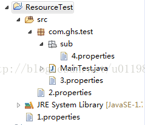
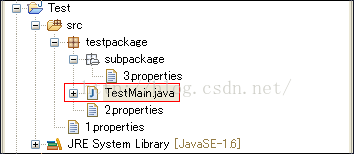

我们以语言为分类总结一下。  
记住所以的路径最终一般解析为文件系统路径


# java


## 一、Linux和Windows路径分隔符

Linux下：”/”

Window下：”\\\\”

Java中通用：System.getProperty(“file.separator”);

## 二、相对路径
一般有两种写法`file\` 和`./file`

### 2.1 相对路径的概念

相对路径指的是相对JVM的启动路径。

举个例子：假设有一java源文件Example.java在d盘根目录下。我们进入命令行窗口，进入到d盘根目录下，然后用“javac Example.java”来编译此文件，编译无错后，会在d盘根目录下自动生成”Example.class”文件。我们再调用”java Example”来运行该程。此时我们已经启动了一个jvm，这个jvm是在d盘根目录下被启动的，所以此jvm所加载的程序中File类的相对路径也就是相对这个路径的，即d盘根目录D:\\。

搞清了这些，我们可以使用相对路径来创建文件，例如:

File file = new File(“a.tx”);

file.createNewFile();

假设jvm是在”D:\\”下启动的，那么a.txt就会生成在D:\\a.txt;

### 2.2 如何通过文件路径创建文件对象

下面的ResourceTest项目中有4个文件，1.properties、2.properties、3.properties、4.properties。

当我们需要使用这4个文件的时候，怎样创建文件对象呢？

  

编译后，4个文件的路径如下：

ResourceTest/1.properties                       
ResourceTest/bin\\2.properties                   
ResourceTest/bin\\com\\ghs\\test\\3.properties      
ResourceTest/bin\\com\\ghs\\test\\sub\\4.properties  

前面我们说过，JAVA中文件路径是相对JVM的启动路径的，对于简单的JAVA项目，其JVM是在项目名称下启动的，所以，ResourceTest中4个文件的相对路径分别是：

./1.properties   或者1.properties                    
./bin\\2.properties  或者  bin\\2.properties                 
./bin\\com\\ghs\\test\\3.properties   或者bin\\com\\ghs\\test\\3.properties   
./bin\\com\\ghs\\test\\sub\\4.properties  或者 bin\\com\\ghs\\test\\sub\\4.properties  

附：“.”或”.\\”代表当前目录，这个目录也就是jvm启动路径。

```java
public class MainTest {
 
	public static void main(String[] args) {
		
		File file1 = new File("./1.properties");
		//File file1 = new File("test1.txt");
		
		File file2 = new File("./bin/2.properties");
		//File file2 = new File("bin/2.properties");
		
		File file3 = new File("./bin/com/ghs/test/3.properties");
		//File file3 = new File("bin/com/ghs/test/3.properties");
 
		File file4 = new File("./bin/com/ghs/test/sub/4.properties");
		//File file4 = new File("bin/com/ghs/test/sub/4.properties");
		
		try {
			System.out.println(file1.exists()+":"+file1.getCanonicalPath());
			System.out.println(file2.exists()+":"+file2.getCanonicalPath());
			System.out.println(file3.exists()+":"+file3.getCanonicalPath());
			System.out.println(file4.exists()+":"+file4.getCanonicalPath());
		} catch (IOException e) {
			e.printStackTrace();
		}
	}
}
```
程序运行结果如下：

true:D:\\me\\open\\open-project\\ResourceTest\\1.properties  
true:D:\\me\\open\\open-project\\ResourceTest\\bin\\2.properties  
true:D:\\me\\open\\open-project\\ResourceTest\\bin\\com\\ghs\\test\\3.properties  
true:D:\\me\\open\\open-project\\ResourceTest\\bin\\com\\ghs\\test\\sub\\4.properties  

  

上面创建文件的方式太过于繁琐，所以一般情况下，对于test2.txt和text3.txt的获取，我们倾向于采取下面的方法：

File file2 = new File(Test.class.getResource("/test2.txt").toURI());

File file2 = new File(Test.class.getResource("test3.txt").toURI());

  

Tomcat中的情况，如果在tomcat中运行web应用,此时,如果我们在某个类中使用如下代码:

File f = new File(".");

String absolutePath = f.getAbsolutePath();

System.out.println(absolutePath);

那么输出的将是tomcat下的bin目录.我的机器就D:\\work\\server\\jakarta-tomcat-5.0.28\\bin\\.，由此可以看出tomcat服务器是在bin目录下启动jvm的，其实是在bin目录下的“catalina.bat”文件中启动jvm的。

### 2.3 当前目录和上级目录

“.”或”.\\”代表当前目录，这个目录也就是jvm启动路径。

下面的代码能得到当前完整目录：

File f = new File(".");

String absolutePath = f.getAbsolutePath();

System.out.println(absolutePath);//D:\\

在当前目录下建立文件：File f = new File(“.\\\\test1.txt”);

“..”代表当前目录的上级目录。

在上级目录建立文件：File f = new File(“..\\\\..\\\\test1.txt”);
### 三、getPath()、getAbsolutePath()、getCanonicalPath()的区别

getPath()获取的是新建文件时的路径，例如：

File file1 = new File(".\\\\test1.txt");通过getPath()获取的是.\\\\test1.txt

File file = new File("D:\\\\Text.txt");通过getPath()获取的是D:\\\\Text.txt

getAbsolutePath()获取的是文件的绝对路径，返回当前目录的路径+构造file时候的路径,例如：

File file1 = new File(".\\\\test1.txt");通过getAbsolutePath()获取的是D:\\workspace\\test\\.\\test1.txt

getCanonicalPath()获取的也是文件的绝对路径，而且把..或者.这样的符号解析出来，例如：File file = new File("..\\\\src

\\\\test1.txt");通过getCanonicalPath()获取的是D:\\workspace\\src\\test1.txt

### 四、获取上级目录

getParent()或者getParentFile();

### 五、获取资源的路径

Java中取资源时，经常用到Class.getResource()和ClassLoader.getResource()，这里来看看他们在取资源文件时候的路径问题。

#### 1.Class.getResource(String path)

path  不以’/'开头时，默认是从此类所在的包下取资源；path  以’/'开头时，则是从ClassPath根下获取；

什么意思呢？看下面这段代码的输出结果就明白了：
```java
package testpackage;
public class TestMain{
    public static void main(String[] args) {
        System.out.println(TestMain.class.getResource(""));
        System.out.println(TestMain.class.getResource("/"));
    }
} 
```
输出结果：

file:/E:/workspace/Test/bin/testpackage/

file:/E:/workspace/Test/bin/

上面说到的【path以’/'开头时，则是从ClassPath根下获取】，在这里就是相当于bin目录(Eclipse环境下)。

如果我们想在TestMain.java中分别取到1~3.properties文件，该怎么写路径呢？代码如下

```java
package testpackage;
 
public class TestMain{
    public static void main(String[] args) {
        // 当前类(class)所在的包目录
        System.out.println(TestMain.class.getResource(""));
        // class根目录
        System.out.println(TestMain.class.getResource("/"));
        
        // TestMain.class在<bin>/testpackage包中
        // 2.properties  在<bin>/testpackage包中
        System.out.println(TestMain.class.getResource("2.properties"));
        
        // TestMain.class在<bin>/testpackage包中
        // 3.properties  在<bin>/testpackage.subpackage包中
        System.out.println(TestMain.class.getResource("subpackage/3.properties"));
        
        // TestMain.class在<bin>/testpackage包中
        // 1.properties  在bin目录（class根目录）
        System.out.println(TestMain.class.getResource("/1.properties"));
    }
}
```
※Class.getResource和Class.getResourceAsStream在使用时，路径选择上是一样的。  

  

2.Class.getClassLoader().getResource(String path)

path不能以’/'开头时；

path是从ClassPath根下获取；

Class.getClassLoader().getResource(String path)
```java
package testpackage;
public class TestMain{
    public static void main(String[] args) {
        TestMain t= new TestMain();
        System.out.println(t.getClass());
        System.out.println(t.getClass().getClassLoader());
        System.out.println(t.getClass().getClassLoader().getResource(""));
        System.out.println(t.getClass().getClassLoader().getResource("/"));//null
    }
}
```
输出结果：  

class testpackage.TestMainsun.misc.Launcher$AppClassLoader@1fb8ee3file:/E:/workspace/Test/bin/

null

从结果来看【TestMain.class.getResource("/") == t.getClass().getClassLoader().getResource("")】

上面同样的目录结构，使用Class.getClassLoader（）.getResource(String path)可以这么写：
```java
package testpackage;
public class TestMain{
    public static void main(String[] args) {
        TestMain t= new TestMain();
        System.out.println(t.getClass().getClassLoader().getResource(""));
        
        System.out.println(t.getClass().getClassLoader().getResource("1.properties"));
        System.out.println(t.getClass().getClassLoader().getResource("testpackage/2.properties"));
        System.out.println(t.getClass().getClassLoader().getResource("testpackage/subpackage/3.properties"));
    }
}
```

# python

```python
import os
print(os.getcwd())
```

对于当前目录的写法，有：

（1）/ 当前工作目录所在的最顶级目录，即[根目录](https://so.csdn.net/so/search?q=%E6%A0%B9%E7%9B%AE%E5%BD%95&spm=1001.2101.3001.7020 "根目录")，根目录是相对于其他子目录来说的

（2）./ 当前工作目录

（3）../ 当前工作目录上一级目录（当前目录的父级目录）

为了更好的说明，我们举两个例子。在运行代码前，首先用getcwd（）获取当前工作目录为：C:\\Users\\86181\\PycharmProjects\\pythonProject1

代码1：

```python

import os
import matplotlib.pyplot as plt
from d2l import torch as d2l
print(os.getcwd())
d2l.set_figsize()
img = d2l.plt.imread('../img/OIP-C.jpg')
d2l.plt.imshow(img)
plt.show()

```

此时我的img文件夹应该放在与pythonProject1平级的文件夹内： 


 代码2：

```python
import os
import matplotlib.pyplot as plt
from d2l import torch as d2l
print(os.getcwd())
d2l.set_figsize()
img = d2l.plt.imread('./img/OIP-C.jpg')
d2l.plt.imshow(img)
plt.show()
```

