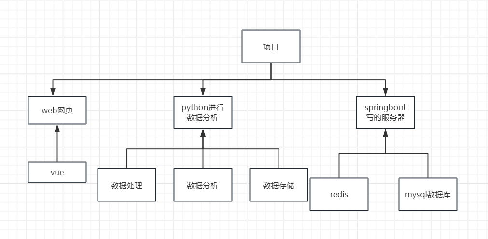
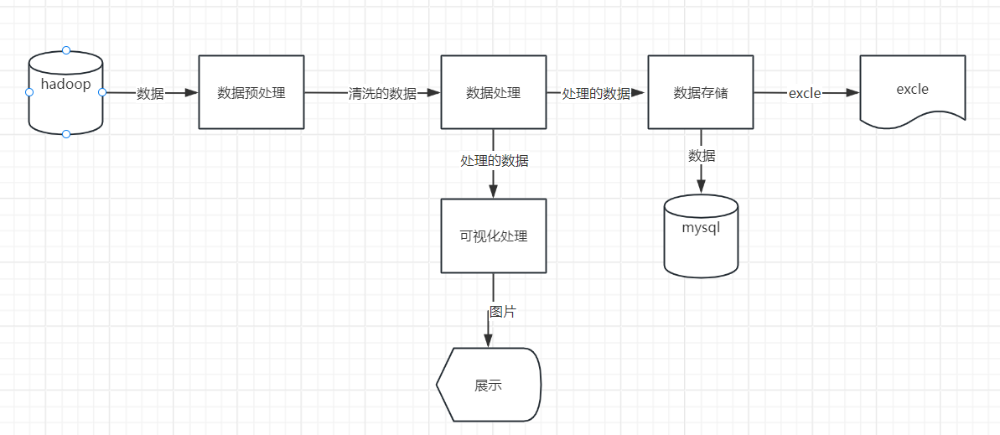
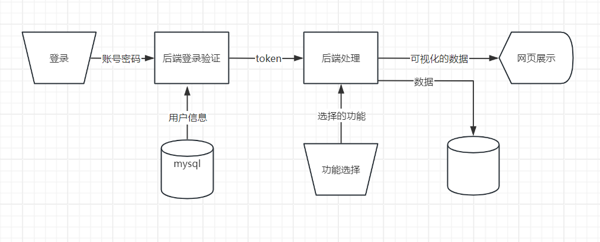
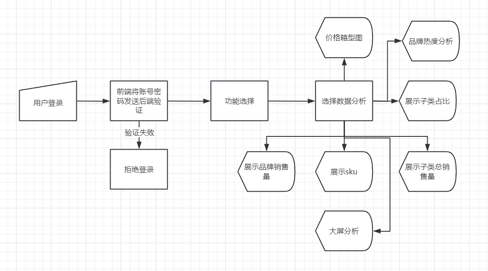

### 系统的层次图

整个项目被分为3部分 web网页前端，springboot的后端 ，还有由python组成的数据处理系统

每一个部分都被分开

### 数据流图

#### python数据处理系统的数据流图

1. 需要启动虚拟机
2. 在node1节点启动hadoop
3. 获得数据集以后会启动`juypter`，打开`makeupana`文件
4. 开始进行数据处理和数据分析具体参照 [spark淘宝数据处理](spark淘宝数据处理.md) 
5. 处理完之后会产生处理结果给web使用
6. 存储数据到`mysql` 具体原理 [关于将csv写入mysql.md](关于将csv写入mysql.md) 

#### web的数据流图

### springboot后端的系统流程图

这里展示整体的结构各个`controler`查看其他文档

### web前端的系统流程图

