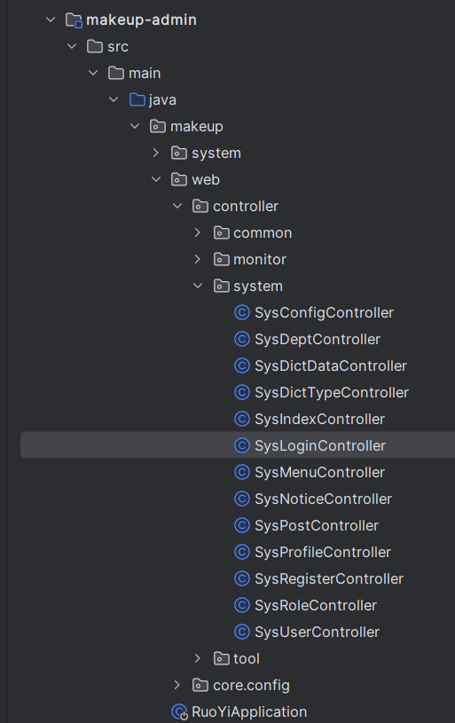

### 系统的层次图


整个项目被分为3部分 web网页前端，springboot的后端 ，还有由python组成的数据处理系统

每一个部分都被分开

### 数据流图

#### python数据处理系统的数据流图


1. 需要启动虚拟机
2. 在node1节点启动hadoop
3. 获得数据集以后会启动`juypter`，打开`makeupana`文件
4. 开始进行数据处理和数据分析具体参照 [spark淘宝数据处理](spark淘宝数据处理.md) 
5. 处理完之后会产生处理结果给web使用
6. 存储数据到`mysql` 具体原理 [关于将csv写入mysql.md](关于将csv写入mysql.md) 

#### web的数据流图


### springboot后端的系统流程图


#### 上图各个模块的代码解释

**账户密码登录**

当收到的请求是登录请求时请求会被发送到

这个controler

```javascript
package makeup.web.controller.system;
//import部分sheng

/**
 * 登录验证
 * 
 * @author ruoyi
 */
@RestController
public class SysLoginController
{
    @Autowired
    private SysLoginService loginService;

    @Autowired
    private ISysMenuService menuService;

    @Autowired
    private SysPermissionService permissionService;

    /**
     * 登录方法
     * 
     * @param loginBody 登录信息
     * @return 结果
     */
    @PostMapping("/login")
    public AjaxResult login(@RequestBody LoginBody loginBody)
    {
        AjaxResult ajax = AjaxResult.success();
        // 生成令牌
        String token = loginService.login(loginBody.getUsername(), loginBody.getPassword(), loginBody.getCode(),
                loginBody.getUuid());
        ajax.put(Constants.TOKEN, token);
        return ajax;
    }

    /**
     * 获取用户信息
     * 
     * @return 用户信息
     */
    @GetMapping("getInfo")
    public AjaxResult getInfo()
    {
        SysUser user = SecurityUtils.getLoginUser().getUser();
        // 角色集合
        Set<String> roles = permissionService.getRolePermission(user);
        // 权限集合
        Set<String> permissions = permissionService.getMenuPermission(user);
        AjaxResult ajax = AjaxResult.success();
        ajax.put("user", user);
        ajax.put("roles", roles);
        ajax.put("permissions", permissions);
        return ajax;
    }

    /**
     * 获取路由信息
     * 
     * @return 路由信息
     */
    @GetMapping("getRouters")
    public AjaxResult getRouters()
    {
        Long userId = SecurityUtils.getUserId();
        List<SysMenu> menus = menuService.selectMenuTreeByUserId(userId);
        return AjaxResult.success(menuService.buildMenus(menus));
    }
}
```

这段代码是一个Java Spring Boot控制器类，名为`SysLoginController`，用于处理登录验证和获取用户信息的请求。

主要功能包括：

1. `login`方法：处理登录请求，验证用户名、密码和验证码，并生成令牌(token)。使用`SysLoginService`的`login`方法进行登录验证，并将令牌存储在`AjaxResult`对象中返回给客户端。

2. `getInfo`方法：获取当前登录用户的信息。使用`SecurityUtils`获取当前登录用户的信息，并通过`SysPermissionService`获取用户的角色集合和权限集合。将用户信息、角色和权限存储在`AjaxResult`对象中返回给客户端。

3. `getRouters`方法：获取用户的路由信息。使用`SecurityUtils`获取当前登录用户的ID，然后使用`ISysMenuService`查询该用户可访问的菜单树。最后，通过`menuService.buildMenus`方法将菜单列表转换为路由信息，并将结果存储在`AjaxResult`对象中返回给客户端。

此代码主要用于实现用户登录验证和获取用户信息的功能，以及获取用户可访问的路由信息用于前端页面的渲染和权限控制。

对于登录部分的代码具体的流程就是

当用户发起登录请求时，`login`方法会被调用。该方法使用`@PostMapping("/login")`注解，表示它处理POST请求，并映射到"/login"路径。

方法签名如下：

```java
@PostMapping("/login")
public AjaxResult login(@RequestBody LoginBody loginBody)
```

方法参数是一个`LoginBody`对象，该对象包含登录所需的信息，包括用户名、密码、验证码和UUID。使用`@RequestBody`注解将请求体中的JSON数据映射到`LoginBody`对象。

方法体内的逻辑如下：

```java
AjaxResult ajax = AjaxResult.success();
String token = loginService.login(loginBody.getUsername(), loginBody.getPassword(), loginBody.getCode(), loginBody.getUuid());
ajax.put(Constants.TOKEN, token);
return ajax;
```

首先，创建一个成功的`AjaxResult`对象，表示登录成功。然后调用`loginService.login`方法进行登录验证，并传递用户名、密码、验证码和UUID作为参数。该方法返回一个令牌(token)，表示登录成功。

接下来，将令牌(token)存储在`AjaxResult`对象中，使用`ajax.put(Constants.TOKEN, token)`将令牌存储在名为"token"的键下。

最后，将包含令牌的`AjaxResult`对象作为响应返回给客户端。

通过这段代码，用户可以通过发送包含用户名、密码、验证码的POST请求来进行登录验证，并获取生成的令牌(token)。令牌可以用于后续的身份验证和授权操作。

### web前端的系统流程图


