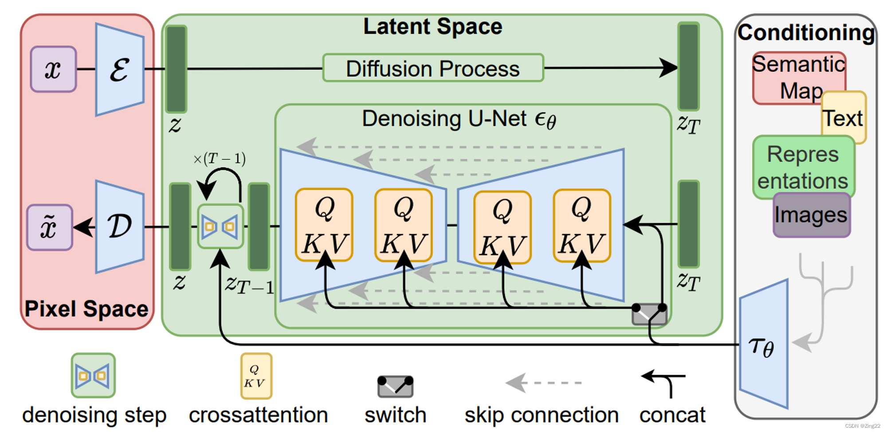
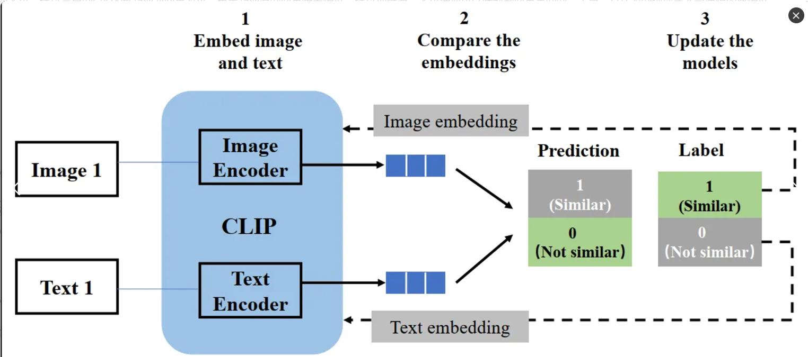
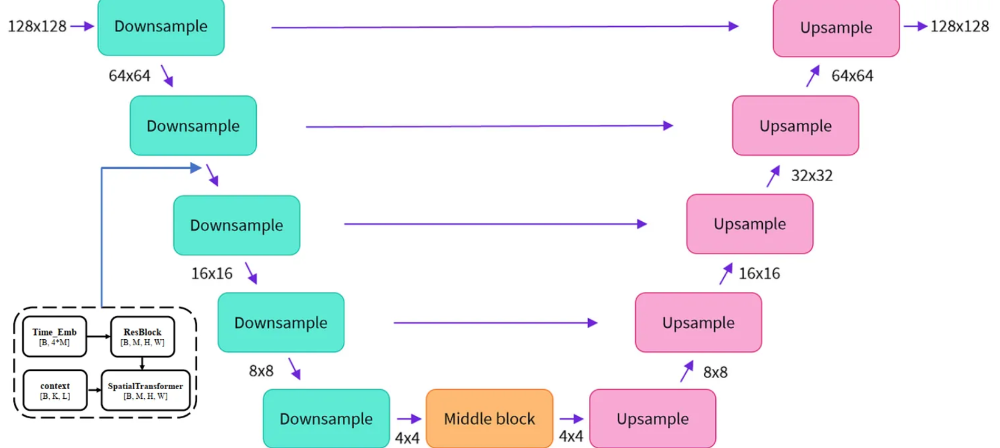

### 稳定扩散的组成

整个扩散过程是在潜空间（`Latent Space`）进行的所以StableDiffusion也是被称为LDM（`LatentDiffusion`）

而图像从像素空间（`Pixel Space`）的转换依赖两个`Encoder`也就是`VAE` 一个$$\varepsilon $$,一个$$D$$​

图片的生成是将将一个噪声在$$T$$ 步的逆扩散步骤下，并且在文本条件的约束下，最终生成一个图片的潜空间表示

最终在`VAE`下生成图片

#### 像素空间与隐空间

- 像素空间（`Pixel Space`），上图左侧，红框部分。通常是人眼可以识别的图像内容。
- 隐空间（`Latent Space`），上图中央，绿框部分。通常是人眼无法识别的内容，但包含的信息量与像素空间相近。

#### 文字编码器（CLIP一个由openai提出）

`CLIP`（`Contrastive Language-Image Pretraining`）是一种由`OpenAI`开发的模型，旨在将自然语言处理（`NLP`）和计算机视觉（`CV`）相结合。`CLIP`模型通过对图像和文本进行对比学习，从而使其能够理解图像和相关的描述之间的关联。也就是说`CLIP`可以将图片与文字在某种意义上产生在语义空间上的联系。

比起对文字进行单纯的`OneHot`编码或者`Word2Vec`这个`CLIP`更好就如同之前所说，它所产生的向量（张量）能够具有图片信息而非仅仅的文字信息。

#### vae（Variational Auto Encoders）(一个可以将图片转化为潜变量空间，或者有潜空间到图像空间)

##### VAE的作用

1.像素空间到隐空间

> 输入的图像$$x$$，经过`Encode`r（图中蓝色的$$\varepsilon $$），转换为另一种shape的张量$$z$$，即称为隐空间。
>
> 从压缩角度理解：图像经过转换后，产生的新张量是人眼无法识别的。但其包含的信息量相差不大，数据尺寸却大幅缩小，因此可以看做是一种图像数据压缩方式。这个真是为什么`StableDiffusion`能快速推理的原因

2.隐空间到像素空间

> 经过模型处理后的隐向量输出$$z$$（特指绿框左下角的$$z$$），经过Decoder（图中蓝色的$$D$$​），转换回像素空间。这个模型是预先训练好的，所以在`LDM`训练时是不需要优化参数的
>
> `VAE`也是通过增加噪声还原来训练的

##### 原理

>原始张量输入，经过非常简单的网络结构，转换成较小的张量
>在Latent张量上，加一点点噪声扰动
>用对称的简单网络结构，还原回原始大小
>对比输入前后的张量是否相似

##### 特点

>网络计算复杂度比较低
>Encoder和Decoder可以分开使用
>无监督训练，不需要标注输入的label

#### U-Net结构(一个由潜空间生成图像，同时又注意力机制可以输入文本条件)

##### `U-Net`网络的目的

U-Net这个模型的的输入是带有噪声的隐变量$$z_t$$,当前时间戳$$t$$，文本经过`CLIP`计算所产生的张量$$E$$ ,最终输出预测噪声。

##### `U-Net`的模型结构

`U-Net`大致上可以分为三块：降采样层、中间层、上采样层。之所以叫`U-Net`，是因为它的模型结构类似字母U。

具体的结构你可以参考[深入浅出完整解析Stable Diffusion（SD）核心基础知识 - 知乎 (zhihu.com)](https://zhuanlan.zhihu.com/p/632809634)

和[【AIGC】Stable Diffusion原理快速上手，模型结构、关键组件、训练预测方式_stable diffusion网络结构-CSDN博客](https://blog.csdn.net/Mr_Zing/article/details/130277246)

### 稳定扩散模型训练过程

Stable Diffusion整体的训练逻辑也非常清晰：

1. 从数据集中随机选择一个训练样本
2. 从K个噪声量级随机抽样一个timestep $$𝑡$$
3. 将timestep $$𝑡$$对应的高斯噪声添加到图片中
4. 将加噪图片输入`U-Net`中预测噪声
5. 计算真实噪声和预测噪声的$$L_{SD}$$损失
6. 计算梯度并更新`U-Net`模型参数

`U-Net`的损失函数是
$$
L_{SD}=\mathbb{E}_{\mathbf{x}_{0},\mathbf{\epsilon}\sim \mathcal{N}(\mathbf{0}, \mathbf{I}), t}\Big[ \| \mathbf{\epsilon}- \mathbf{\epsilon}_\theta\big(\sqrt{\bar{\alpha}_t}\mathbf{x}_0 + \sqrt{1 - \bar{\alpha}_t}\mathbf{\epsilon}, t, \mathbf{c}\big)\|^2\Big]\\
$$
你在这里可以看出与扩散模型损失函数的形式基本一致，区别就是原来的使用模型`PixelCNN++`预测噪声输入的是原始噪声和时间$$t$$，而现在预测噪声的模型替换为`U-Net`需要多输入一个$$c$$ 文本条件。

但是无论怎么说整个过程想法就是扩散模型的想法。

### 稳定扩散的推理过程

上图的下半部分是推理的过程

1. 随机产生一个高斯噪声作为$$z_t$$,将输入的文本通过`CLIP`转化为张量$$E$$

2. 将$$z_t$$与$$E$$ 同时输入`U-Net` 输出预测噪声$$z_{\theta}$$
3. 将$$z_t$$减去预测噪声$$z_{t-1}=z_t-z{\theta}$$
4. 回到步骤2反复重复T次
5. 经过T步后将最终还原的潜变量通过VAE还原为图片

