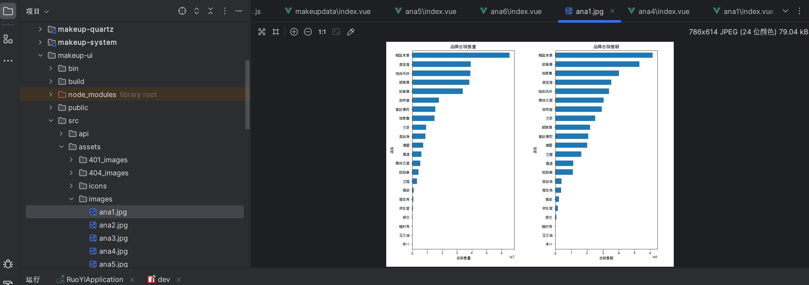
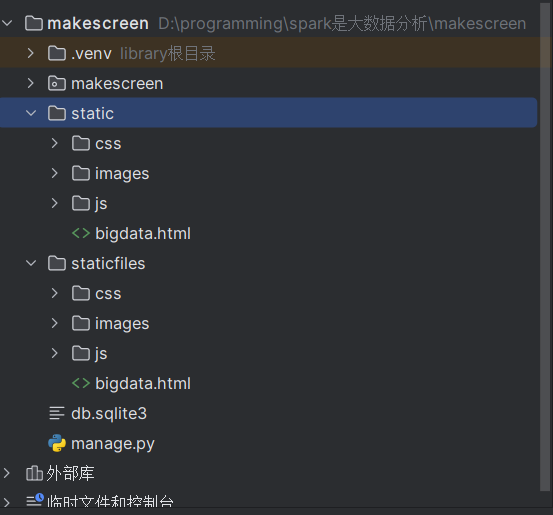
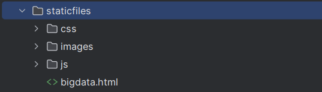
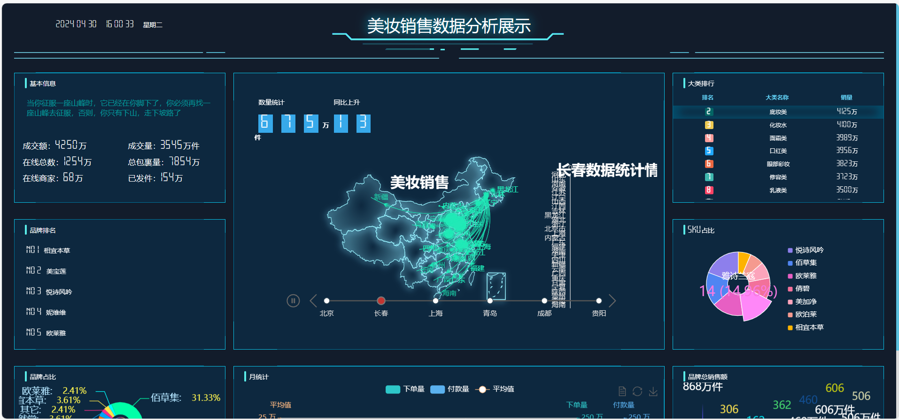
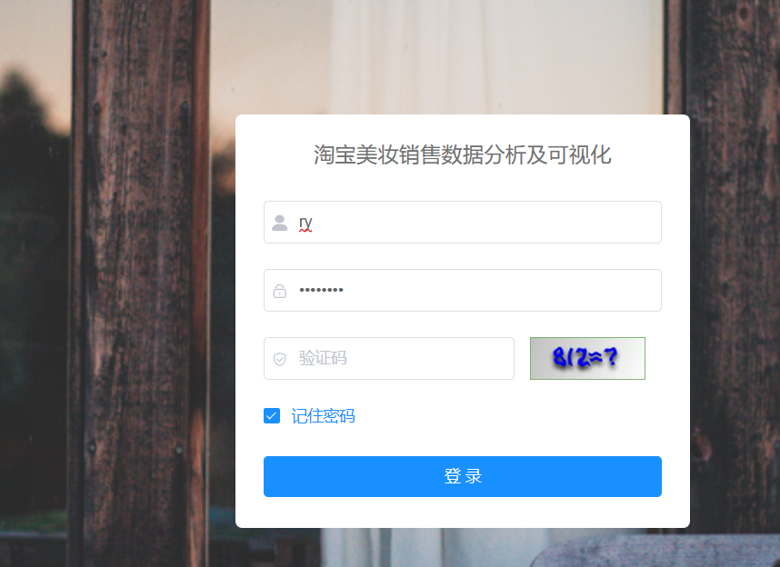
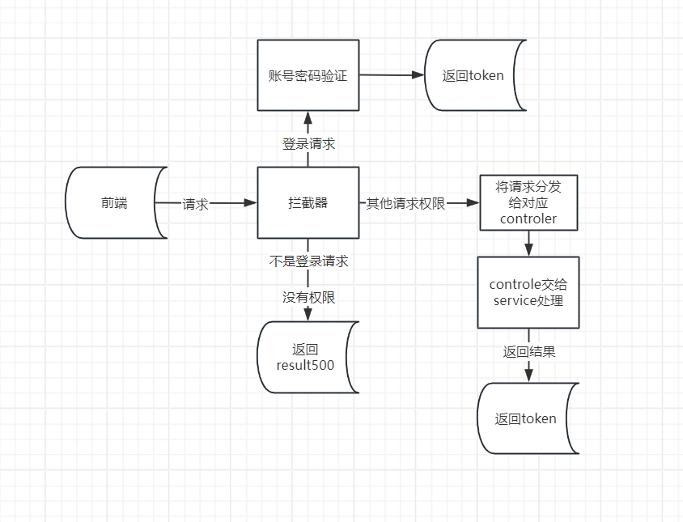

### 首先数据分析

1. 首先我们需要从`hadoop`下载数据集到本地电脑可以使用网页下载也可以可以使用命令行进行下载

   -  命令行的下载方式是

     Hadoop提供了命令行工具来进行文件的下载操作。你可以使用`hadoop fs`命令来执行文件下载。

     下面是下载文件的命令行语法：

     ```
     hadoop fs -get <source> <destination>
     ```

     其中，`<source>`表示要下载的文件路径，可以是HDFS上的文件或目录。`<destination>`表示本地文件系统中保存下载文件的目标路径。

     以下是使用Hadoop命令行下载文件的示例：

     1. 下载单个文件：

     ```bash
     hadoop fs -get hdfs://localhost:9000/path/to/source/file.txt /path/to/destination/
     ```

     该命令将HDFS上的`/path/to/source/file.txt`文件下载到本地文件系统的`/path/to/destination/`目录下。

     2. 下载整个目录：

     ```bash
     hadoop fs -get hdfs://localhost:9000/path/to/source/directory/ /path/to/destination/
     ```

     该命令将HDFS上的`/path/to/source/directory/`目录及其所有内容下载到本地文件系统的`/path/to/destination/`目录下。

     请注意，`-get`命令将文件从HDFS下载到本地文件系统，而不是在Hadoop集群上执行。因此，你需要在运行下载命令的机器上安装Hadoop并设置正确的Hadoop配置。

     此外，还可以使用其他选项来控制下载行为，例如使用`-p`选项来保留与源文件相同的修改时间和权限。


2. 下载好命令行之后你就可以进入到数据预处理和数据分析的部分
   - 首先是数据预处理

     ```python
     # spark
     from pyspark.sql import SparkSession
     
     # 创建SparkSession
     spark = SparkSession.builder.getOrCreate()
     
     # 从本地文件加载数据
     file_path = "demo.csv"
     df = spark.read.csv(file_path, header=True, inferSchema=True)
     df.persist()
     
     # 显示数据的前几行
     df.show()
     
     # 获取数据的形状
     print("数据形状:", (df.count(), len(df.columns)))
     
     # 查看数据的信息
     df.printSchema()
     
     # 计算 '店名' 列的值计数
     df.groupBy('店名').count().show()
     ```

     这段代码使用Spark来读取本地文件并进行一些基本的数据操作和分析。

     具体功能如下：

     1. 创建SparkSession：通过`SparkSession.builder.getOrCreate()`创建一个SparkSession对象，用于与Spark进行交互。

     2. 从本地文件加载数据：使用`spark.read.csv()`方法从本地文件（文件路径为`demo.csv`）中加载数据。`header=True`表示文件包含标题行，`inferSchema=True`表示自动推断列的数据类型。加载后的数据存储在DataFrame对象`df`中，并通过`df.persist()`方法进行持久化（缓存）。

     3. 显示数据的前几行：使用`df.show()`方法显示DataFrame中的前几行数据，默认显示前20行。

     4. 获取数据的形状：通过`df.count()`获取DataFrame中的行数（数据记录数），`len(df.columns)`获取DataFrame中的列数（字段数）。打印出数据的形状，即行数和列数。

     5. 查看数据的信息：使用`df.printSchema()`方法打印DataFrame的结构信息，包括每个列的名称和数据类型。

     6. 计算 '店名' 列的值计数：使用`df.groupBy('店名').count().show()`方法对DataFrame按照 '店名' 列进行分组，并计算每个 '店名' 的出现次数。最后使用`show()`方法展示结果。

     这段代码主要展示了使用Spark进行数据处理和分析的基本操作，包括数据加载、数据展示、数据形状统计、数据结构查看和简单的数据聚合分析。

     还有这段

     ```python
     from pyspark.sql import functions as F
     # 删除重复值
     df = df.dropDuplicates()
     
     # 重置索引
     # df = df.withColumn("index", col("index").cast("int"))
     # df = df.withColumn("index", F.monotonically_increasing_id())
     
     # 查看缺失值
     df.select([F.count(F.when(F.isnull(c), c)).alias(c) for c in df.columns]).show()
     
     # 查看数据结构
     df.describe().show()
     
     # 查看sale_count列的众数
     mode_01 = df.groupBy("sale_count").count().orderBy(F.desc("count")).first()["sale_count"]
     
     # 查看comment_count列的众数
     mode_02 = df.groupBy("comment_count").count().orderBy(F.desc("count")).first()["comment_count"]
     
     # 填充缺失值为0
     df = df.fillna(0)
     
     # 再次查看缺失值
     df.select([F.count(F.when(F.isnull(c), c)).alias(c) for c in df.columns]).show()
     ```

     这段代码使用了`pyspark.sql.functions`模块中的函数来进行一些数据处理和缺失值处理操作。

     具体功能如下：

     1. 删除重复值：使用`df.dropDuplicates()`方法从DataFrame中删除重复的行，保留唯一的行。

     2. 重置索引：这部分代码被注释掉了，可能是用于重置DataFrame的索引。使用`df.withColumn()`方法可以添加一个名为"index"的列，该列的值可以通过`F.monotonically_increasing_id()`函数生成连续递增的唯一标识符。

     3. 查看缺失值：使用`df.select()`方法和列表推导式来查看DataFrame中每列的缺失值数量。`F.count(F.when(F.isnull(c), c))`用于统计列`c`中的缺失值数量，并使用`alias(c)`为结果命名为原始列名。

     4. 查看数据结构：使用`df.describe().show()`方法查看DataFrame的一些统计信息，包括计数、均值、标准差、最小值、最大值等。

     5. 查看sale_count列的众数：使用`df.groupBy("sale_count").count().orderBy(F.desc("count")).first()["sale_count"]`方法计算并获取列"sale_count"中的众数（出现次数最多的值）。

     6. 查看comment_count列的众数：使用`df.groupBy("comment_count").count().orderBy(F.desc("count")).first()["comment_count"]`方法计算并获取列"comment_count"中的众数。

     7. 填充缺失值为0：使用`df.fillna(0)`方法将DataFrame中的缺失值填充为0。

     8. 再次查看缺失值：使用与第3步相同的方法来查看DataFrame中每列的缺失值数量，此时应该显示为0，因为缺失值已经被填充。

     这段代码主要用于数据清洗和缺失值处理，包括删除重复值、重置索引、查看缺失值、查看数据结构、计算列的众数以及填充缺失值。

     **注意因为这两段是我用spark重新写过的所以我在这里解释了其意思，其他的部分请参考《spark淘宝数据处理》**

     这其中详细描述了代码的每一部分那部分是用于数据分析那部分用于数据预处理和那部分用于数据可视化。

3. 在数据分析和数据可视化之后我们会得到可视化的结果结果就是一张一张的图片，这些图片你在数据makeupana.ipyb 运行的过程中你就会看到就是那些得到的结果。

### 得到图片后可以写前端

   在将这些图片粘贴到前项目中的图片文件夹

​	所有的分析图片会被放入makuui前端项目的assert/images中

前端将每一个分析都编写成组件

第一个分析

```vue
<template>
  <div class="container">

    

  </div>
</template>

<script>
export default {
  data() {
    return {
      imageUrl: '@/assets/images/ana1.jpg', 
      labelText: '数据展示',
    };
  },
};
</script>

<style>
.container {
  text-align: center;
}
</style>：
```

> 这段代码是一个Vue组件的代码片段，用于显示一个包含图像和文本的容器。
>
> 具体功能如下：
>
> 1. 模板部分：
>    - 使用`<div class="container">`定义一个容器，设置了居中对齐的样式。
>    - 使用``标签插入图像，设置了图像的宽度为50%，并使用`src`属性指定图像的路径为`@/assets/images/ana2.jpg`，`alt`属性为"数据展示"。
>    
> 2. 脚本部分：
>    - 在`data`属性中定义了一个`imageUrl`变量，值为`@/assets/images/ana1.jpg`，用于存储另一张图像的路径。
>    - 定义了一个`labelText`变量，值为"数据展示"，用于存储文本标签的内容。
>
> 3. 样式部分：
>    - 使用`.container`选择器定义了一个样式规则，使容器内的内容居中对齐。
>
> 这段代码的主要功能是在Vue组件中创建一个包含图像和文本的容器，并通过数据绑定设置图像路径和文本内容。容器的样式设置为居中对齐。这可以用于在网页或应用程序中展示数据相关的信息或图像。

第二个分析

```vue
<template>
  <div class="container">
    <h1>品牌销售量与销售额</h1>
    
  </div>
</template>

<script>
export default {
  data() {
    return {
      imageUrl: '@/assets/images/ana1.jpg', 
      labelText: '数据展示',
    };
  },
};
</script>

<style>
.container {
  text-align: center;
}
</style>
```

这段代码是一个Vue组件的代码片段，用于显示一个包含标题、图像和文本的容器。

具体功能如下：

1. 模板部分：
   - 使用`<div class="container">`定义一个容器，设置了居中对齐的样式。
   - 使用`<h1>`标签插入一个标题，内容为"品牌销售量与销售额"。
   - 使用``标签插入图像，设置了图像的宽度为50%，并使用`src`属性指定图像的路径为`@/assets/images/ana1.jpg`，`alt`属性为"数据展示"。
   
2. 脚本部分：
   - 在`data`属性中定义了一个`imageUrl`变量，值为`@/assets/images/ana1.jpg`，用于存储图像的路径。
   - 定义了一个`labelText`变量，值为"数据展示"，用于存储文本标签的内容。

3. 样式部分：
   - 使用`.container`选择器定义了一个样式规则，使容器内的内容居中对齐。

这段代码有的意思也是一样

第三个分析

```vue
<template>
  <div class="container">
    <h1>品类占比</h1>
    
  </div>
</template>

<script>
export default {
  data() {
    return {
      imageUrl: '@/assets/images/ana1.jpg', 
      labelText: '数据展示',
    };
  },
};
</script>

<style>
.container {
  text-align: center;
}
</style>
```

还有第5个分析第六个都是相同的

6. router的index.js 介绍用vuerouter 将路径绑定到组件上

   ```js
   /**
    * Note: 路由配置项
    *
    * hidden: true                     // 当设置 true 的时候该路由不会再侧边栏出现 如401，login等页面，或者如一些编辑页面/edit/1
    * alwaysShow: true                 // 当你一个路由下面的 children 声明的路由大于1个时，自动会变成嵌套的模式--如组件页面
    *                                  // 只有一个时，会将那个子路由当做根路由显示在侧边栏--如引导页面
    *                                  // 若你想不管路由下面的 children 声明的个数都显示你的根路由
    *                                  // 你可以设置 alwaysShow: true，这样它就会忽略之前定义的规则，一直显示根路由
    * redirect: noRedirect             // 当设置 noRedirect 的时候该路由在面包屑导航中不可被点击
    * name:'router-name'               // 设定路由的名字，一定要填写不然使用<keep-alive>时会出现各种问题
    * query: '{"id": 1, "name": "ry"}' // 访问路由的默认传递参数
    * roles: ['admin', 'common']       // 访问路由的角色权限
    * permissions: ['a:a:a', 'b:b:b']  // 访问路由的菜单权限
    * meta : {
       noCache: true                   // 如果设置为true，则不会被 <keep-alive> 缓存(默认 false)
       title: 'title'                  // 设置该路由在侧边栏和面包屑中展示的名字
       icon: 'svg-name'                // 设置该路由的图标，对应路径src/assets/icons/svg
       breadcrumb: false               // 如果设置为false，则不会在breadcrumb面包屑中显示
       activeMenu: '/system/user'      // 当路由设置了该属性，则会高亮相对应的侧边栏。
     }
    */
   
   // 公共路由
   export const constantRoutes = [
     {
       path: '/redirect',
       component: Layout,
       hidden: true,
       children: [
         {
           path: '/redirect/:path(.*)',
           component: () => import('@/views/redirect')
         }
       ]
     },
     {
       path: '/login',
       component: () => import('@/views/login'),
       hidden: true
     },
     {
       path: '/register',
       component: () => import('@/views/register'),
       hidden: true
     },
     {
       path: '/404',
       component: () => import('@/views/error/404'),
       hidden: true
     },
     {
       path: '/401',
       component: () => import('@/views/error/401'),
       hidden: true
     },
     {
       path: '',
       component: Layout,
       redirect: 'index',
       children: [
         {
           path: 'index',
           component: () => import('@/views/index'),
           name: 'Index',
           meta: { title: '首页', icon: 'dashboard', affix: true }
         }
       ]
     },
     {
       path: '/user',
       component: Layout,
       hidden: true,
       redirect: 'noredirect',
       children: [
         {
           path: 'profile',
           component: () => import('@/views/system/user/profile/index'),
           name: 'Profile',
           meta: { title: '个人中心', icon: 'user' }
         }
       ]
     }
   ]
   ```

​	这就是router配置文件可以将之前写的组件绑定到路径上

Vue Router是Vue.js官方提供的路由管理器，用于实现前端的路由功能。它可以帮助开发者构建单页面应用（SPA）并实现页面之间的导航和跳转。

Vue Router的主要作用包括：

1. 路由映射：Vue Router可以定义路由规则，将不同的URL路径映射到对应的组件，使得在不同的URL路径下展示不同的页面内容。

2. 嵌套路由：Vue Router支持嵌套路由，可以实现页面的多层次嵌套和组织。

3. 路由参数：通过路由参数，可以在URL中传递参数，并在组件中获取参数值，实现根据不同参数展示不同内容的功能。

4. 路由导航：Vue Router提供了路由导航的功能，可以在组件中使用编程式导航（如`router.push()`）或者声明式导航（如`<router-link>`）进行页面的跳转和导航。

5. 路由守卫：Vue Router提供了路由守卫的功能，可以在路由跳转前、跳转后或者路由更新时执行相应的逻辑，例如验证用户身份、权限控制、路由切换动画等。

6. 历史记录管理：Vue Router可以管理浏览器的历史记录，通过使用浏览器的前进和后退按钮，可以在不刷新页面的情况下切换路由。

所以总结前端就是这样向你展示图片的。

### 大屏功能是可以独立的

**还有一个大屏的功能**

首先我们先看目录结构

再看代码

首先manage.py

```python
#!/usr/bin/env python
import os
import sys

if __name__ == "__main__":
    os.environ.setdefault("DJANGO_SETTINGS_MODULE", "makescreen.settings")
    try:
        from django.core.management import execute_from_command_line
    except ImportError as exc:
        raise ImportError(
            "Couldn't import Django. Are you sure it's installed and "
            "available on your PYTHONPATH environment variable? Did you "
            "forget to activate a virtual environment?"
        ) from exc
    execute_from_command_line(sys.argv)
```

这段代码是一个Python脚本，通常用于在Django项目中启动应用程序。

具体功能如下：

1. 首先，代码检查当前模块是否是主模块（即作为脚本直接执行，而不是被导入为模块）。这是通过`if __name__ == "__main__":`这行代码实现的。

2. 设置环境变量：代码通过`os.environ.setdefault()`将环境变量`DJANGO_SETTINGS_MODULE`设置为`makescreen.settings`。这指定了Django项目的设置模块，告诉Django使用哪个配置文件来配置项目。

3. 引入`execute_from_command_line`函数：代码尝试导入`django.core.management`模块中的`execute_from_command_line`函数。这个函数是Django的命令行工具，用于执行各种Django管理命令。

4. 执行Django命令行：最后，代码调用`execute_from_command_line(sys.argv)`，将命令行参数传递给`execute_from_command_line`函数。这样，可以在命令行中使用该脚本来执行Django的各种管理命令，例如启动开发服务器、执行数据库迁移等。

总体来说，这段代码的作用是在Django项目中启动应用程序，并通过命令行来执行各种Django管理命令。

没有什么特别每一个diango项目都有。

```python
"""makescreen URL Configuration

The `urlpatterns` list routes URLs to views. For more information please see:
    https://docs.djangoproject.com/en/2.0/topics/http/urls/
Examples:
Function views
    1. Add an import:  from my_app import views
    2. Add a URL to urlpatterns:  path('', views.home, name='home')
Class-based views
    1. Add an import:  from other_app.views import Home
    2. Add a URL to urlpatterns:  path('', Home.as_view(), name='home')
Including another URLconf
    1. Import the include() function: from django.urls import include, path
    2. Add a URL to urlpatterns:  path('blog/', include('blog.urls'))
"""
from django.conf.urls.static import static
from django.contrib import admin
from django.urls import path
from makescreen import settings

urlpatterns = [
    path('admin/', admin.site.urls),
]


if settings.DEBUG:
    urlpatterns += static(settings.STATIC_URL, document_root=settings.STATIC_ROOT)
```

提供的代码段是一个Django URL配置文件的片段。它包含了`urlpatterns`列表，用于将URL路由到Django项目中的视图函数。

在这个代码片段中，`urlpatterns`列表只包含了一个路径：

```python
path('admin/', admin.site.urls),
```

这个路径将URL `admin/` 映射到Django的管理后台。当用户访问这个URL时，将显示Django管理界面。

另外，代码中有一个`if`语句，它检查项目设置模块（`makescreen.settings`）中的`DEBUG`设置是否为`True`。如果是，`urlpatterns`列表将会通过调用`static()`函数来扩展。这个函数用于在开发期间提供静态文件的访问。它会根据设置中的`STATIC_ROOT`目录，添加一个用于提供静态文件（如CSS、JavaScript和图片）的URL模式。

wsgi.py

```python
"""
WSGI config for makescreen project.

It exposes the WSGI callable as a module-level variable named ``application``.

For more information on this file, see
https://docs.djangoproject.com/en/2.0/howto/deployment/wsgi/
"""

import os

from django.core.wsgi import get_wsgi_application

os.environ.setdefault("DJANGO_SETTINGS_MODULE", "makescreen.settings")

application = get_wsgi_application()
```

显然你已经可以看出这个makeupscreen的项目文件唯一的作用就是将



这个文件夹可以被当成静态资源访问。但是我们也是直接可以从浏览器打开不需要django

如图

### 开始了解怎么登录，先是前端的登录

那么前端的作用是什么前端就是为了能够实现登录功能



当你在登录的时候你会发现当你不登录你就会自动的跳回登录界面，这是因为有拦截器的存在。




结合这两张图

#### 整体代码

1. 第一张图的登录现在是在前端这一块的代码是在makeup-ui/src/views/login.vue

   ```vue
   <template>
     <div class="login">
       <el-form ref="loginForm" :model="loginForm" :rules="loginRules" class="login-form">
         <h3 class="title">淘宝美妆销售数据分析及可视化</h3>
         <el-form-item prop="username">
           <el-input
             v-model="loginForm.username"
             type="text"
             auto-complete="off"
             placeholder="账号"
           >
             <svg-icon slot="prefix" icon-class="user" class="el-input__icon input-icon" />
           </el-input>
         </el-form-item>
         <el-form-item prop="password">
           <el-input
             v-model="loginForm.password"
             type="password"
             auto-complete="off"
             placeholder="密码"
             @keyup.enter.native="handleLogin"
           >
             <svg-icon slot="prefix" icon-class="password" class="el-input__icon input-icon" />
           </el-input>
         </el-form-item>
         <el-form-item prop="code" v-if="captchaEnabled">
           <el-input
             v-model="loginForm.code"
             auto-complete="off"
             placeholder="验证码"
             style="width: 63%"
             @keyup.enter.native="handleLogin"
           >
             <svg-icon slot="prefix" icon-class="validCode" class="el-input__icon input-icon" />
           </el-input>
           <div class="login-code">
             
           </div>
         </el-form-item>
         <el-checkbox v-model="loginForm.rememberMe" style="margin:0px 0px 25px 0px;">记住密码</el-checkbox>
         <el-form-item style="width:100%;">
           <el-button
             :loading="loading"
             size="medium"
             type="primary"
             style="width:100%;"
             @click.native.prevent="handleLogin"
           >
             <span v-if="!loading">登 录</span>
             <span v-else>登 录 中...</span>
           </el-button>
           <div style="float: right;" v-if="register">
             <router-link class="link-type" :to="'/register'">立即注册</router-link>
           </div>
         </el-form-item>
       </el-form>
       <!--  底部  -->
       <div class="el-login-footer">
         <span>Copyright © 2018-2023 ruoyi.vip All Rights Reserved.</span>
       </div>
     </div>
   </template>
   
   <script>
   import { getCodeImg } from "@/api/login";
   import Cookies from "js-cookie";
   import { encrypt, decrypt } from '@/utils/jsencrypt'
   
   export default {
     name: "Login",
     data() {
       return {
         codeUrl: "",
         loginForm: {
           username: "admin",
           password: "admin123",
           rememberMe: false,
           code: "",
           uuid: ""
         },
         loginRules: {
           username: [
             { required: true, trigger: "blur", message: "请输入您的账号" }
           ],
           password: [
             { required: true, trigger: "blur", message: "请输入您的密码" }
           ],
           code: [{ required: true, trigger: "change", message: "请输入验证码" }]
         },
         loading: false,
         // 验证码开关
         captchaEnabled: true,
         // 注册开关
         register: false,
         redirect: undefined
       };
     },
     watch: {
       $route: {
         handler: function(route) {
           this.redirect = route.query && route.query.redirect;
         },
         immediate: true
       }
     },
     created() {
       this.getCode();
       this.getCookie();
     },
     methods: {
       getCode() {
         getCodeImg().then(res => {
           this.captchaEnabled = res.captchaEnabled === undefined ? true : res.captchaEnabled;
           if (this.captchaEnabled) {
             this.codeUrl = "data:image/gif;base64," + res.img;
             this.loginForm.uuid = res.uuid;
           }
         });
       },
       getCookie() {
         const username = Cookies.get("username");
         const password = Cookies.get("password");
         const rememberMe = Cookies.get('rememberMe')
         this.loginForm = {
           username: username === undefined ? this.loginForm.username : username,
           password: password === undefined ? this.loginForm.password : decrypt(password),
           rememberMe: rememberMe === undefined ? false : Boolean(rememberMe)
         };
       },
       handleLogin() {
         this.$refs.loginForm.validate(valid => {
           if (valid) {
             this.loading = true;
             if (this.loginForm.rememberMe) {
               Cookies.set("username", this.loginForm.username, { expires: 30 });
               Cookies.set("password", encrypt(this.loginForm.password), { expires: 30 });
               Cookies.set('rememberMe', this.loginForm.rememberMe, { expires: 30 });
             } else {
               Cookies.remove("username");
               Cookies.remove("password");
               Cookies.remove('rememberMe');
             }
             this.$store.dispatch("Login", this.loginForm).then(() => {
               this.$router.push({ path: this.redirect || "/" }).catch(()=>{});
             }).catch(() => {
               this.loading = false;
               if (this.captchaEnabled) {
                 this.getCode();
               }
             });
           }
         });
       }
     }
   };
   </script>
   
   
   ```

这段代码是一个Vue.js组件，表示一个登录页面。下面是对代码的解释：

1. 模板部分（template）：这部分定义了登录页面的HTML结构，使用了Element UI库的组件来构建表单和按钮等元素。登录表单包括账号、密码和验证码等输入框，以及记住密码的复选框和登录按钮。底部显示了版权信息。

2. 脚本部分（script）：这部分是Vue组件的JavaScript代码。其中，`getCodeImg`和`encrypt`、`decrypt`是从其他模块中导入的函数。这个组件的名称是`Login`，数据（data）部分定义了登录表单的初始值和校验规则，以及其他需要的变量。`created`方法在组件创建时被调用，用于获取验证码并获取保存的cookie。`getCode`方法用于获取验证码的图片，并根据接口返回的数据判断是否显示验证码输入框。`getCookie`方法用于获取保存的cookie值，并将其赋值给登录表单。`handleLogin`方法用于处理登录操作，首先校验表单数据的有效性，然后根据是否记住密码设置cookie，最后调用`Login` action进行登录，成功后跳转到指定页面。

这段代码使用了Element UI组件库来构建登录页面，并使用axios库来发送HTTP请求。它还使用了一些辅助函数和工具，如获取验证码图片、加密和解密等。

#### 具体代码

```js
handleLogin() {
  this.$refs.loginForm.validate(valid => {
    if (valid) {
      this.loading = true;
      if (this.loginForm.rememberMe) {
        Cookies.set("username", this.loginForm.username, { expires: 30 });
        Cookies.set("password", encrypt(this.loginForm.password), { expires: 30 });
        Cookies.set('rememberMe', this.loginForm.rememberMe, { expires: 30 });
      } else {
        Cookies.remove("username");
        Cookies.remove("password");
        Cookies.remove('rememberMe');
      }
      this.$store.dispatch("Login", this.loginForm).then(() => {
        this.$router.push({ path: this.redirect || "/" }).catch(()=>{});
      }).catch(() => {
        this.loading = false;
        if (this.captchaEnabled) {
          this.getCode();
        }
      });
    }
  });
```

这段代码是`handleLogin`方法，用于处理用户登录操作。下面是对代码的解释：

1. `this.$refs.loginForm.validate`：使用`this.$refs`来访问组件中的具名引用（ref），`loginForm`是表单组件的引用名称。`validate`是Element UI表单组件提供的方法，用于校验表单字段的有效性。它接受一个回调函数作为参数，回调函数会在校验完成后被调用，并传入一个布尔值`valid`表示表单是否有效。

2. `if (valid)`：如果表单校验有效，则执行以下代码块。

3. `this.loading = true`：将`loading`设置为`true`，用于显示登录按钮的加载状态。

4. `if (this.loginForm.rememberMe)`：如果用户选择了"记住密码"选项，则执行以下代码块。

   - `Cookies.set("username", this.loginForm.username, { expires: 30 })`：使用`Cookies`工具函数设置一个名为"username"的cookie，保存用户输入的用户名，有效期为30天。
   - `Cookies.set("password", encrypt(this.loginForm.password), { expires: 30 })`：使用`encrypt`函数对用户输入的密码进行加密，并将加密后的密码保存在名为"password"的cookie中，有效期为30天。
   - `Cookies.set('rememberMe', this.loginForm.rememberMe, { expires: 30 })`：保存"rememberMe"选项的值到名为"rememberMe"的cookie中，有效期为30天。

5. `else`：如果用户没有选择"记住密码"选项，则执行以下代码块。

   - `Cookies.remove("username")`：移除名为"username"的cookie。
   - `Cookies.remove("password")`：移除名为"password"的cookie。
   - `Cookies.remove('rememberMe')`：移除名为"rememberMe"的cookie。

6. `this.$store.dispatch("Login", this.loginForm)`：通过`this.$store.dispatch`方法触发名为"Login"的action，并传递`this.loginForm`作为参数。这个action会处理用户登录逻辑，发送登录请求等。

7. `.then(() => { this.$router.push({ path: this.redirect || "/" }).catch(()=>{}); })`：如果登录成功，通过`this.$router.push`方法将用户重定向到指定的路径（`this.redirect`）或默认路径"/"。`.catch(()=>{})`用于捕获可能的重定向错误，避免控制台抛出异常。

8. `.catch(() => { this.loading = false; if (this.captchaEnabled) { this.getCode(); } })`：如果登录失败，执行以下代码块。

   - `this.loading = false`：将`loading`设置为`false`，用于取消登录按钮的加载状态。
   - `if (this.captchaEnabled)`：如果验证码开关为打开状态，则执行以下代码块。
     - `this.getCode()`：重新获取验证码图片。

这段代码的功能是校验表单的有效性，根据用户选择的"记住密码"选项设置相应的cookie，然后触发登录动作，并根据登录结果进行相应的处理，包括重定向和验证码的刷新。

```js
getCode() {
  getCodeImg().then(res => {
    this.captchaEnabled = res.captchaEnabled === undefined ? true : res.captchaEnabled;
    if (this.captchaEnabled) {
      this.codeUrl = "data:image/gif;base64," + res.img;
      this.loginForm.uuid = res.uuid;
    }
  });
},
getCookie() {
  const username = Cookies.get("username");
  const password = Cookies.get("password");
  const rememberMe = Cookies.get('rememberMe')
  this.loginForm = {
    username: username === undefined ? this.loginForm.username : username,
    password: password === undefined ? this.loginForm.password : decrypt(password),
    rememberMe: rememberMe === undefined ? false : Boolean(rememberMe)
  };
},
```

这段代码包含了两个方法：`getCode()`和`getCookie()`，下面是对它们的解释：

1. `getCode()`方法用于获取验证码图片，并更新相关的状态和数据。

   - `getCodeImg()`：调用`getCodeImg()`函数来获取验证码图片，返回一个Promise对象。
   - `.then(res => { ... })`：当获取验证码成功后，执行回调函数，回调函数的参数`res`包含了获取到的数据。
   - `this.captchaEnabled = res.captchaEnabled === undefined ? true : res.captchaEnabled;`：根据返回的数据中的`captchaEnabled`字段判断是否启用验证码。如果`captchaEnabled`字段未定义，将`this.captchaEnabled`设置为`true`，否则根据返回值来设置。
   - `if (this.captchaEnabled) { ... }`：如果验证码启用，执行以下代码块。
     - `this.codeUrl = "data:image/gif;base64," + res.img;`：将获取到的验证码图片数据拼接成Base64格式的URL，并赋值给`this.codeUrl`，用于在页面上显示验证码图片。
     - `this.loginForm.uuid = res.uuid;`：将返回的验证码UUID赋值给登录表单中的`uuid`字段。

2. `getCookie()`方法用于获取保存的cookie，并将其值赋给登录表单的相应字段。

   - `const username = Cookies.get("username");`：使用`Cookies.get()`函数获取名为"username"的cookie的值，并将其赋给变量`username`。
   - `const password = Cookies.get("password");`：使用`Cookies.get()`函数获取名为"password"的cookie的值，并将其赋给变量`password`。
   - `const rememberMe = Cookies.get('rememberMe')`：使用`Cookies.get()`函数获取名为"rememberMe"的cookie的值，并将其赋给变量`rememberMe`。
   - `this.loginForm = { ... }`：将获取到的cookie值更新到登录表单的相应字段。
     - `username === undefined ? this.loginForm.username : username`：如果`username`为`undefined`，则使用登录表单中的`username`字段的初始值，否则使用`username`的值。
     - `password === undefined ? this.loginForm.password : decrypt(password)`：如果`password`为`undefined`，则使用登录表单中的`password`字段的初始值，否则使用`password`的值。注意，这里使用了`decrypt()`函数对保存的加密密码进行解密。
     - `rememberMe === undefined ? false : Boolean(rememberMe)`：如果`rememberMe`为`undefined`，则设置为`false`，否则将`rememberMe`转换为对应的布尔值。

这两个方法分别用于获取验证码图片和获取保存的cookie，并更新相关的状态和数据，以便在登录页面中显示验证码图片和填充保存的用户名和密码（如果存在）。

到现在前端登录的功能的过程就是会将你的请求发送给后端。

### 请求到后端怎么处理登录


后端首先第一步要经历拦截器

#### 先到拦截器

什么是springboot的拦截器

在Spring Boot中，拦截器（Interceptor）是一种用于拦截请求并在处理请求之前或之后执行一些操作的机制。拦截器是Spring框架提供的一种增强控制器功能的方式，它可以用于实现诸如身份验证、日志记录、性能监控、请求处理前后的预处理和后处理等功能。

拦截器是基于Spring框架的AOP（面向切面编程）思想实现的。它通过定义拦截器类并将其配置到Spring应用程序中，使得拦截器可以在请求被处理前或处理后介入请求的处理流程。

在Spring Boot中，创建一个拦截器需要实现`HandlerInterceptor`接口，并实现其中的方法。主要的方法包括：

1. `preHandle`：在请求处理之前被调用。可以进行一些预处理操作，如身份验证、权限检查等。如果该方法返回`false`，则请求将被拦截，后续的处理流程将被终止。

2. `postHandle`：在请求处理之后、视图渲染之前被调用。可以对请求处理结果进行一些处理或修改。

3. `afterCompletion`：在整个请求处理完成后被调用。可以进行一些清理操作或资源释放等。

拦截器可以通过配置来应用于特定的请求路径或URL模式。在Spring Boot中，可以通过实现`WebMvcConfigurer`接口中的`addInterceptors`方法，或使用`@Configuration`注解和`WebMvcConfigurerAdapter`类来进行拦截器的配置。

所以你后端项目的拦截器在

```java
package makeup.framework.config;

import java.util.concurrent.TimeUnit;
import org.springframework.beans.factory.annotation.Autowired;
import org.springframework.context.annotation.Bean;
import org.springframework.context.annotation.Configuration;
import org.springframework.http.CacheControl;
import org.springframework.web.cors.CorsConfiguration;
import org.springframework.web.cors.UrlBasedCorsConfigurationSource;
import org.springframework.web.filter.CorsFilter;
import org.springframework.web.servlet.config.annotation.InterceptorRegistry;
import org.springframework.web.servlet.config.annotation.ResourceHandlerRegistry;
import org.springframework.web.servlet.config.annotation.WebMvcConfigurer;
import makeup.common.config.RuoYiConfig;
import makeup.common.constant.Constants;
import makeup.framework.interceptor.RepeatSubmitInterceptor;

/**
 * 通用配置
 * 
 * @author ruoyi
 */
@Configuration
public class ResourcesConfig implements WebMvcConfigurer
{
    @Autowired
    private RepeatSubmitInterceptor repeatSubmitInterceptor;

    @Override
    public void addResourceHandlers(ResourceHandlerRegistry registry)
    {
        /** 本地文件上传路径 */
        registry.addResourceHandler(Constants.RESOURCE_PREFIX + "/**")
                .addResourceLocations("file:" + RuoYiConfig.getProfile() + "/");

        /** swagger配置 */
        registry.addResourceHandler("/swagger-ui/**")
                .addResourceLocations("classpath:/META-INF/resources/webjars/springfox-swagger-ui/")
                .setCacheControl(CacheControl.maxAge(5, TimeUnit.HOURS).cachePublic());;
    }

    /**
     * 自定义拦截规则
     */
    @Override
    public void addInterceptors(InterceptorRegistry registry)
    {
        registry.addInterceptor(repeatSubmitInterceptor).addPathPatterns("/**");
    }

    /**
     * 跨域配置
     */
    @Bean
    public CorsFilter corsFilter()
    {
        CorsConfiguration config = new CorsConfiguration();
        config.setAllowCredentials(true);
        // 设置访问源地址
        config.addAllowedOriginPattern("*");
        // 设置访问源请求头
        config.addAllowedHeader("*");
        // 设置访问源请求方法
        config.addAllowedMethod("*");
        // 有效期 1800秒
        config.setMaxAge(1800L);
        // 添加映射路径，拦截一切请求
        UrlBasedCorsConfigurationSource source = new UrlBasedCorsConfigurationSource();
        source.registerCorsConfiguration("/**", config);
        // 返回新的CorsFilter
        return new CorsFilter(source);
    }
}
```

添加的拦截器的具体代码如下

```java
package makeup.framework.interceptor;

import java.lang.reflect.Method;
import javax.servlet.http.HttpServletRequest;
import javax.servlet.http.HttpServletResponse;
import org.springframework.stereotype.Component;
import org.springframework.web.method.HandlerMethod;
import org.springframework.web.servlet.HandlerInterceptor;
import com.alibaba.fastjson2.JSON;
import makeup.common.annotation.RepeatSubmit;
import makeup.common.core.domain.AjaxResult;
import makeup.common.utils.ServletUtils;

/**
 * 防止重复提交拦截器
 *
 * @author ruoyi
 */
@Component
public abstract class RepeatSubmitInterceptor implements HandlerInterceptor
{
    @Override
    public boolean preHandle(HttpServletRequest request, HttpServletResponse response, Object handler) throws Exception
    {
        if (handler instanceof HandlerMethod)
        {
            HandlerMethod handlerMethod = (HandlerMethod) handler;
            Method method = handlerMethod.getMethod();
            RepeatSubmit annotation = method.getAnnotation(RepeatSubmit.class);
            if (annotation != null)
            {
                if (this.isRepeatSubmit(request, annotation))
                {
                    AjaxResult ajaxResult = AjaxResult.error(annotation.message());
                    ServletUtils.renderString(response, JSON.toJSONString(ajaxResult));
                    return false;
                }
            }
            return true;
        }
        else
        {
            return true;
        }
    }

    /**
     * 验证是否重复提交由子类实现具体的防重复提交的规则
     *
     * @param request 请求信息
     * @param annotation 防重复注解参数
     * @return 结果
     * @throws Exception
     */
    public abstract boolean isRepeatSubmit(HttpServletRequest request, RepeatSubmit annotation);
}
```

这段代码是一个防止重复提交的拦截器实现，它是一个抽象类 `RepeatSubmitInterceptor`，实现了 Spring Framework 的 `HandlerInterceptor` 接口。

主要功能如下：

1. 在 `preHandle` 方法中，拦截器首先判断处理请求的方法是否带有 `@RepeatSubmit` 注解，如果有该注解，则表示需要进行重复提交的验证。
2. 如果请求方法带有 `@RepeatSubmit` 注解，则调用抽象方法 `isRepeatSubmit`，由子类实现具体的防重复提交的规则。
3. `isRepeatSubmit` 方法接收请求信息和 `@RepeatSubmit` 注解作为参数，子类需要根据具体需求来判断当前请求是否属于重复提交。
4. 如果 `isRepeatSubmit` 方法返回 `true`，表示请求是重复提交，拦截器会返回一个错误的响应给客户端，响应内容为一个包含错误信息的 JSON 对象。
5. 如果 `isRepeatSubmit` 方法返回 `false`，表示请求不是重复提交，拦截器允许请求继续处理。

需要注意的是，这是一个抽象类，`isRepeatSubmit` 方法是抽象方法，子类需要继承该类并实现具体的重复提交验证规则。

此拦截器可用于在处理请求之前进行重复提交的验证，以避免重复提交表单或重复执行某些操作。它提供了一种通用的机制，可以在不同的请求处理方法上添加 `@RepeatSubmit` 注解，并通过子类自定义的验证逻辑来实现具体的防重复提交策略。


**登录请求的模块** 这是接下来的步骤

#### 再到controler 控制器

后端的登录请求的功能实现在src/main/java/makeup/web/controller/system/SysLoginController.java

```java
package makeup.web.controller.system;

import java.util.List;
import java.util.Set;
import org.springframework.beans.factory.annotation.Autowired;
import org.springframework.web.bind.annotation.GetMapping;
import org.springframework.web.bind.annotation.PostMapping;
import org.springframework.web.bind.annotation.RequestBody;
import org.springframework.web.bind.annotation.RestController;
import makeup.common.constant.Constants;
import makeup.common.core.domain.AjaxResult;
import makeup.common.core.domain.entity.SysMenu;
import makeup.common.core.domain.entity.SysUser;
import makeup.common.core.domain.model.LoginBody;
import makeup.common.utils.SecurityUtils;
import makeup.framework.web.service.SysLoginService;
import makeup.framework.web.service.SysPermissionService;
import makeup.system.service.ISysMenuService;

/**
 * 登录验证
 * 
 * @author ruoyi
 */
@RestController
public class SysLoginController
{
    @Autowired
    private SysLoginService loginService;

    @Autowired
    private ISysMenuService menuService;

    @Autowired
    private SysPermissionService permissionService;

    /**
     * 登录方法
     * 
     * @param loginBody 登录信息
     * @return 结果
     */
    @PostMapping("/login")
    public AjaxResult login(@RequestBody LoginBody loginBody)
    {
        AjaxResult ajax = AjaxResult.success();
        // 生成令牌
        String token = loginService.login(loginBody.getUsername(), loginBody.getPassword(), loginBody.getCode(),
                loginBody.getUuid());
        ajax.put(Constants.TOKEN, token);
        return ajax;
    }

    /**
     * 获取用户信息
     * 
     * @return 用户信息
     */
    @GetMapping("getInfo")
    public AjaxResult getInfo()
    {
        SysUser user = SecurityUtils.getLoginUser().getUser();
        // 角色集合
        Set<String> roles = permissionService.getRolePermission(user);
        // 权限集合
        Set<String> permissions = permissionService.getMenuPermission(user);
        AjaxResult ajax = AjaxResult.success();
        ajax.put("user", user);
        ajax.put("roles", roles);
        ajax.put("permissions", permissions);
        return ajax;
    }

    /**
     * 获取路由信息
     * 
     * @return 路由信息
     */
    @GetMapping("getRouters")
    public AjaxResult getRouters()
    {
        Long userId = SecurityUtils.getUserId();
        List<SysMenu> menus = menuService.selectMenuTreeByUserId(userId);
        return AjaxResult.success(menuService.buildMenus(menus));
    }
}
```

这段代码是一个 `SysLoginController` 类，使用了 `@RestController` 注解，表示它是一个控制器类，并且该类中的方法返回的是 JSON 数据。

该类中包含以下方法：

1. `login` 方法：使用 `@PostMapping` 注解，映射了 "/login" 路径的 POST 请求。该方法接收一个 `LoginBody` 对象作为请求体，并返回一个 `AjaxResult` 对象作为响应结果。该方法用于处理用户登录请求，并返回登录结果和生成的令牌（token）。

2. `getInfo` 方法：使用 `@GetMapping` 注解，映射了 "/getInfo" 路径的 GET 请求。该方法不接收任何参数，返回一个 `AjaxResult` 对象作为响应结果。该方法用于获取当前登录用户的信息，包括用户信息、角色集合和权限集合。

3. `getRouters` 方法：使用 `@GetMapping` 注解，映射了 "/getRouters" 路径的 GET 请求。该方法不接收任何参数，返回一个 `AjaxResult` 对象作为响应结果。该方法用于获取当前登录用户的路由信息，即菜单信息，返回的菜单数据经过处理后构建成路由的格式。

在该类中，使用了 `@Autowired` 注解对 `SysLoginService`、`ISysMenuService` 和 `SysPermissionService` 进行自动注入，这些服务类可以在方法中被调用。

该类的目的是处理用户登录、获取用户信息和获取路由信息的请求，并返回相应的结果。这些方法通过调用相应的服务类来实现业务逻辑，并将结果封装成 `AjaxResult` 对象返回给客户端。

#### 再到业务层Service

**注意springboot 的业务逻辑一般是写在service中的**

所以你需要进入到服务层查看具体的代码

```java
package makeup.framework.web.service;

import javax.annotation.Resource;
import org.springframework.beans.factory.annotation.Autowired;
import org.springframework.security.authentication.AuthenticationManager;
import org.springframework.security.authentication.BadCredentialsException;
import org.springframework.security.authentication.UsernamePasswordAuthenticationToken;
import org.springframework.security.core.Authentication;
import org.springframework.stereotype.Component;
import makeup.common.constant.CacheConstants;
import makeup.common.constant.Constants;
import makeup.common.constant.UserConstants;
import makeup.common.core.domain.entity.SysUser;
import makeup.common.core.domain.model.LoginUser;
import makeup.common.core.redis.RedisCache;
import makeup.common.exception.ServiceException;
import makeup.common.exception.user.BlackListException;
import makeup.common.exception.user.CaptchaException;
import makeup.common.exception.user.CaptchaExpireException;
import makeup.common.exception.user.UserNotExistsException;
import makeup.common.exception.user.UserPasswordNotMatchException;
import makeup.common.utils.DateUtils;
import makeup.common.utils.MessageUtils;
import makeup.common.utils.StringUtils;
import makeup.common.utils.ip.IpUtils;
import makeup.framework.manager.AsyncManager;
import makeup.framework.manager.factory.AsyncFactory;
import makeup.framework.security.context.AuthenticationContextHolder;
import makeup.system.service.ISysConfigService;
import makeup.system.service.ISysUserService;

/**
 * 登录校验方法
 * 
 * @author ruoyi
 */
@Component
public class SysLoginService
{
    @Autowired
    private TokenService tokenService;

    @Resource
    private AuthenticationManager authenticationManager;

    @Autowired
    private RedisCache redisCache;
    
    @Autowired
    private ISysUserService userService;

    @Autowired
    private ISysConfigService configService;

    /**
     * 登录验证
     * 
     * @param username 用户名
     * @param password 密码
     * @param code 验证码
     * @param uuid 唯一标识
     * @return 结果
     */
    public String login(String username, String password, String code, String uuid)
    {
        // 验证码校验
        validateCaptcha(username, code, uuid);
        // 登录前置校验
        loginPreCheck(username, password);
        // 用户验证
        Authentication authentication = null;
        try
        {
            UsernamePasswordAuthenticationToken authenticationToken = new UsernamePasswordAuthenticationToken(username, password);
            AuthenticationContextHolder.setContext(authenticationToken);
            // 该方法会去调用UserDetailsServiceImpl.loadUserByUsername
            authentication = authenticationManager.authenticate(authenticationToken);
        }
        catch (Exception e)
        {
            if (e instanceof BadCredentialsException)
            {
                AsyncManager.me().execute(AsyncFactory.recordLogininfor(username, Constants.LOGIN_FAIL, MessageUtils.message("user.password.not.match")));
                throw new UserPasswordNotMatchException();
            }
            else
            {
                AsyncManager.me().execute(AsyncFactory.recordLogininfor(username, Constants.LOGIN_FAIL, e.getMessage()));
                throw new ServiceException(e.getMessage());
            }
        }
        finally
        {
            AuthenticationContextHolder.clearContext();
        }
        AsyncManager.me().execute(AsyncFactory.recordLogininfor(username, Constants.LOGIN_SUCCESS, MessageUtils.message("user.login.success")));
        LoginUser loginUser = (LoginUser) authentication.getPrincipal();
        recordLoginInfo(loginUser.getUserId());
        // 生成token
        return tokenService.createToken(loginUser);
    }

    /**
     * 校验验证码
     * 
     * @param username 用户名
     * @param code 验证码
     * @param uuid 唯一标识
     * @return 结果
     */
    public void validateCaptcha(String username, String code, String uuid)
    {
        boolean captchaEnabled = configService.selectCaptchaEnabled();
        if (captchaEnabled)
        {
            String verifyKey = CacheConstants.CAPTCHA_CODE_KEY + StringUtils.nvl(uuid, "");
            String captcha = redisCache.getCacheObject(verifyKey);
            redisCache.deleteObject(verifyKey);
            if (captcha == null)
            {
                AsyncManager.me().execute(AsyncFactory.recordLogininfor(username, Constants.LOGIN_FAIL, MessageUtils.message("user.jcaptcha.expire")));
                throw new CaptchaExpireException();
            }
            if (!code.equalsIgnoreCase(captcha))
            {
                AsyncManager.me().execute(AsyncFactory.recordLogininfor(username, Constants.LOGIN_FAIL, MessageUtils.message("user.jcaptcha.error")));
                throw new CaptchaException();
            }
        }
    }

    /**
     * 登录前置校验
     * @param username 用户名
     * @param password 用户密码
     */
    public void loginPreCheck(String username, String password)
    {
        // 用户名或密码为空 错误
        if (StringUtils.isEmpty(username) || StringUtils.isEmpty(password))
        {
            AsyncManager.me().execute(AsyncFactory.recordLogininfor(username, Constants.LOGIN_FAIL, MessageUtils.message("not.null")));
            throw new UserNotExistsException();
        }
        // 密码如果不在指定范围内 错误
        if (password.length() < UserConstants.PASSWORD_MIN_LENGTH
                || password.length() > UserConstants.PASSWORD_MAX_LENGTH)
        {
            AsyncManager.me().execute(AsyncFactory.recordLogininfor(username, Constants.LOGIN_FAIL, MessageUtils.message("user.password.not.match")));
            throw new UserPasswordNotMatchException();
        }
        // 用户名不在指定范围内 错误
        if (username.length() < UserConstants.USERNAME_MIN_LENGTH
                || username.length() > UserConstants.USERNAME_MAX_LENGTH)
        {
            AsyncManager.me().execute(AsyncFactory.recordLogininfor(username, Constants.LOGIN_FAIL, MessageUtils.message("user.password.not.match")));
            throw new UserPasswordNotMatchException();
        }
        // IP黑名单校验
        String blackStr = configService.selectConfigByKey("sys.login.blackIPList");
        if (IpUtils.isMatchedIp(blackStr, IpUtils.getIpAddr()))
        {
            AsyncManager.me().execute(AsyncFactory.recordLogininfor(username, Constants.LOGIN_FAIL, MessageUtils.message("login.blocked")));
            throw new BlackListException();
        }
    }

    /**
     * 记录登录信息
     *
     * @param userId 用户ID
     */
    public void recordLoginInfo(Long userId)
    {
        SysUser sysUser = new SysUser();
        sysUser.setUserId(userId);
        sysUser.setLoginIp(IpUtils.getIpAddr());
        sysUser.setLoginDate(DateUtils.getNowDate());
        userService.updateUserProfile(sysUser);
    }
}
```

这段代码是一个 `SysLoginService` 类，用于处理用户登录相关的业务逻辑。

这段代码是一个用于用户登录验证的服务类 `SysLoginService`。它包含了一些方法用于处理用户登录的不同方面。

1. `login` 方法：该方法用于验证用户登录。它接收用户名、密码、验证码和唯一标识作为参数，并返回一个生成的令牌（token）。在方法中，首先进行验证码校验，如果验证码功能启用，会从缓存中获取验证码并与用户输入的验证码进行比对。如果验证码过期或不匹配，将抛出相应的异常。接下来，该方法会进行登录前置校验，包括检查用户名和密码是否为空，以及长度是否符合要求。如果校验未通过，将抛出相应的异常。然后，使用 `AuthenticationManager` 进行用户验证。如果验证失败，会记录登录失败的日志并抛出用户密码不匹配的异常。如果验证成功，将记录登录成功的日志信息，并调用 `recordLoginInfo` 方法记录用户的登录信息。最后，通过调用 `tokenService` 的 `createToken` 方法生成令牌，并将其返回给调用方。

2. `validateCaptcha` 方法：该方法用于校验验证码。它接收用户名、验证码和唯一标识作为参数。首先从缓存中获取与唯一标识相关联的验证码，并与用户输入的验证码进行比对。如果验证码过期或不匹配，将抛出相应的异常。如果验证码校验功能未启用，则不会进行验证码校验。

3. `loginPreCheck` 方法：该方法用于进行登录前置校验。它接收用户名和密码作为参数。首先检查用户名和密码是否为空，如果为空，将抛出用户不存在的异常。然后检查密码和用户名的长度是否符合要求，如果不符合要求，将抛出用户密码不匹配的异常。接下来，该方法会检查用户的 IP 是否在黑名单中，如果是，则抛出黑名单异常。

4. `recordLoginInfo` 方法：该方法用于记录用户的登录信息。它接收用户ID作为参数，并根据用户ID获取用户信息。然后，将用户的登录IP和登录时间记录在用户信息中，并通过调用 `userService` 的 `updateUserProfile` 方法将更新后的用户信息保存到数据库中。

该类使用了 `@Autowired` 和 `@Resource` 注解对依赖的服务和组件进行自动注入，包括 `TokenService`、`AuthenticationManager`、`RedisCache`、`ISysUserService` 和 `ISysConfigService` 等。这些服务和组件提供了用户登录验证所需的功能，例如生成令牌、用户认证、缓存操作等。

总体而言，`SysLoginService` 类实现了用户登录验证的逻辑，包括验证码校验、登录前置校验、用户认证、记录登录信息和生成令牌等功能。它与其他服务类和组件协同工作，提供了完整的用户登录验证流程。

#### 最后到数据库redis mysql

比如你看这里的就使用lrediscache

```java
package makeup.common.core.redis;

import java.util.Collection;
import java.util.Iterator;
import java.util.List;
import java.util.Map;
import java.util.Set;
import java.util.concurrent.TimeUnit;
import org.springframework.beans.factory.annotation.Autowired;
import org.springframework.data.redis.core.BoundSetOperations;
import org.springframework.data.redis.core.HashOperations;
import org.springframework.data.redis.core.RedisTemplate;
import org.springframework.data.redis.core.ValueOperations;
import org.springframework.stereotype.Component;

/**
 * spring redis 工具类
 *
 * @author ruoyi
 **/
@SuppressWarnings(value = { "unchecked", "rawtypes" })
@Component
public class RedisCache
{
    @Autowired
    public RedisTemplate redisTemplate;

    /**
     * 缓存基本的对象，Integer、String、实体类等
     *
     * @param key 缓存的键值
     * @param value 缓存的值
     */
    public <T> void setCacheObject(final String key, final T value)
    {
        redisTemplate.opsForValue().set(key, value);
    }

    /**
     * 缓存基本的对象，Integer、String、实体类等
     *
     * @param key 缓存的键值
     * @param value 缓存的值
     * @param timeout 时间
     * @param timeUnit 时间颗粒度
     */
    public <T> void setCacheObject(final String key, final T value, final Integer timeout, final TimeUnit timeUnit)
    {
        redisTemplate.opsForValue().set(key, value, timeout, timeUnit);
    }

    /**
     * 设置有效时间
     *
     * @param key Redis键
     * @param timeout 超时时间
     * @return true=设置成功；false=设置失败
     */
    public boolean expire(final String key, final long timeout)
    {
        return expire(key, timeout, TimeUnit.SECONDS);
    }

    /**
     * 设置有效时间
     *
     * @param key Redis键
     * @param timeout 超时时间
     * @param unit 时间单位
     * @return true=设置成功；false=设置失败
     */
    public boolean expire(final String key, final long timeout, final TimeUnit unit)
    {
        return redisTemplate.expire(key, timeout, unit);
    }

    /**
     * 获取有效时间
     *
     * @param key Redis键
     * @return 有效时间
     */
    public long getExpire(final String key)
    {
        return redisTemplate.getExpire(key);
    }

    /**
     * 判断 key是否存在
     *
     * @param key 键
     * @return true 存在 false不存在
     */
    public Boolean hasKey(String key)
    {
        return redisTemplate.hasKey(key);
    }

    /**
     * 获得缓存的基本对象。
     *
     * @param key 缓存键值
     * @return 缓存键值对应的数据
     */
    public <T> T getCacheObject(final String key)
    {
        ValueOperations<String, T> operation = redisTemplate.opsForValue();
        return operation.get(key);
    }

    /**
     * 删除单个对象
     *
     * @param key
     */
    public boolean deleteObject(final String key)
    {
        return redisTemplate.delete(key);
    }

    /**
     * 删除集合对象
     *
     * @param collection 多个对象
     * @return
     */
    public boolean deleteObject(final Collection collection)
    {
        return redisTemplate.delete(collection) > 0;
    }

    /**
     * 缓存List数据
     *
     * @param key 缓存的键值
     * @param dataList 待缓存的List数据
     * @return 缓存的对象
     */
    public <T> long setCacheList(final String key, final List<T> dataList)
    {
        Long count = redisTemplate.opsForList().rightPushAll(key, dataList);
        return count == null ? 0 : count;
    }

    /**
     * 获得缓存的list对象
     *
     * @param key 缓存的键值
     * @return 缓存键值对应的数据
     */
    public <T> List<T> getCacheList(final String key)
    {
        return redisTemplate.opsForList().range(key, 0, -1);
    }

    /**
     * 缓存Set
     *
     * @param key 缓存键值
     * @param dataSet 缓存的数据
     * @return 缓存数据的对象
     */
    public <T> BoundSetOperations<String, T> setCacheSet(final String key, final Set<T> dataSet)
    {
        BoundSetOperations<String, T> setOperation = redisTemplate.boundSetOps(key);
        Iterator<T> it = dataSet.iterator();
        while (it.hasNext())
        {
            setOperation.add(it.next());
        }
        return setOperation;
    }

    /**
     * 获得缓存的set
     *
     * @param key
     * @return
     */
    public <T> Set<T> getCacheSet(final String key)
    {
        return redisTemplate.opsForSet().members(key);
    }

    /**
     * 缓存Map
     *
     * @param key
     * @param dataMap
     */
    public <T> void setCacheMap(final String key, final Map<String, T> dataMap)
    {
        if (dataMap != null) {
            redisTemplate.opsForHash().putAll(key, dataMap);
        }
    }

    /**
     * 获得缓存的Map
     *
     * @param key
     * @return
     */
    public <T> Map<String, T> getCacheMap(final String key)
    {
        return redisTemplate.opsForHash().entries(key);
    }

    /**
     * 往Hash中存入数据
     *
     * @param key Redis键
     * @param hKey Hash键
     * @param value 值
     */
    public <T> void setCacheMapValue(final String key, final String hKey, final T value)
    {
        redisTemplate.opsForHash().put(key, hKey, value);
    }

    /**
     * 获取Hash中的数据
     *
     * @param key Redis键
     * @param hKey Hash键
     * @return Hash中的对象
     */
    public <T> T getCacheMapValue(final String key, final String hKey)
    {
        HashOperations<String, String, T> opsForHash = redisTemplate.opsForHash();
        return opsForHash.get(key, hKey);
    }

    /**
     * 获取多个Hash中的数据
     *
     * @param key Redis键
     * @param hKeys Hash键集合
     * @return Hash对象集合
     */
    public <T> List<T> getMultiCacheMapValue(final String key, final Collection<Object> hKeys)
    {
        return redisTemplate.opsForHash().multiGet(key, hKeys);
    }

    /**
     * 删除Hash中的某条数据
     *
     * @param key Redis键
     * @param hKey Hash键
     * @return 是否成功
     */
    public boolean deleteCacheMapValue(final String key, final String hKey)
    {
        return redisTemplate.opsForHash().delete(key, hKey) > 0;
    }

    /**
     * 获得缓存的基本对象列表
     *
     * @param pattern 字符串前缀
     * @return 对象列表
     */
    public Collection<String> keys(final String pattern)
    {
        return redisTemplate.keys(pattern);
    }
}
```

这段代码是一个名为`RedisCache`的实用类，它使用Spring Data Redis库提供了与Redis缓存交互的各种方法。让我们简单介绍一下这段代码的功能：

1. `setCacheObject`：该方法允许你缓存基本对象，如整数、字符串或任何其他实体类。它会将给定键的值设置到Redis缓存中。

2. `setCacheObject`（带超时）：该方法与前一个方法类似，但它还允许你为缓存对象指定超时时间。在指定的超时时间后，对象将自动过期并从缓存中删除。

3. `expire`：该方法设置Redis缓存中键的过期时间。你可以指定超时值和时间单位（例如秒、分钟等）。如果成功设置了过期时间，则返回true。

4. `getExpire`：该方法返回Redis缓存中键的剩余存活时间（过期时间）。

5. `hasKey`：该方法检查Redis缓存中是否存在某个键。如果键存在，则返回true；否则返回false。

6. `getCacheObject`：该方法根据给定的键从Redis缓存中检索缓存的对象。

7. `deleteObject`：该方法根据给定的键从Redis缓存中删除单个对象。

8. `deleteObject`（集合）：该方法根据给定的键集合从Redis缓存中删除多个对象。

9. `setCacheList`：该方法将一个对象列表缓存到与给定键相关联的Redis缓存中。它返回添加到列表中的对象数量。

10. `getCacheList`：该方法根据给定的键从Redis缓存中检索缓存的对象列表。

11. `setCacheSet`：该方法将一个对象集合缓存到与给定键相关联的Redis缓存中。它返回与键相关的缓存数据对象。

12. `getCacheSet`：该方法根据给定的键从Redis缓存中检索缓存的集合对象。

13. `setCacheMap`：该方法将一个Map缓存到与给定键相关联的Redis缓存中。

14. `getCacheMap`：该方法根据给定的键从Redis缓存中检索缓存的Map对象。

15. `setCacheMapValue`：该方法将数据存储到Redis缓存的哈希表中。

16. `getCacheMapValue`：该方法从Redis缓存的哈希表中获取数据。

17. `getMultiCacheMapValue`：该方法从Redis缓存的哈希表中获取多个数据。

18. `deleteCacheMapValue`：该方法从Redis缓存的哈希表中删除某个数据。

19. `keys`：该方法根据给定的模式获取Redis缓存中的键集合。

总之，这段代码封装了一些常用的Redis缓存操作方法，方便在Spring应用中进行缓存操作。

在上面的代码中，Redis的作用是作为缓存存储。它提供了一种快速、可扩展的方式来存储和获取数据，以减少对后端数据源（例如数据库）的访问。

具体来说，`RedisCache`类中的各个方法利用Spring Data Redis库与Redis缓存进行交互，实现了以下功能：

1. `setCacheObject`和`setCacheObject`（带超时）方法用于将对象缓存到Redis中。这可以提高后续对该对象的读取速度，避免重复计算或数据库查询。

2. `expire`方法设置Redis缓存中键的过期时间。通过设置过期时间，可以确保缓存数据在一段时间后自动过期，从而避免缓存过时或占用过多内存。

3. `getCacheObject`方法用于从Redis缓存中获取缓存的对象。如果缓存中存在该对象，则可以直接从Redis中获取，而无需执行其他操作。

4. `deleteObject`和`deleteObject`（集合）方法用于从Redis缓存中删除对象。当数据发生变化或不再需要缓存时，可以使用这些方法清除缓存数据。

5. `setCacheList`和`getCacheList`方法用于缓存和获取列表对象。这可以在需要缓存一组相关数据时使用，例如最新的文章列表或用户的历史记录。

6. `setCacheSet`和`getCacheSet`方法用于缓存和获取集合对象。这可以用于存储唯一值的集合，如用户的标签或商品的分类。

7. `setCacheMap`、`getCacheMap`、`setCacheMapValue`、`getCacheMapValue`、`getMultiCacheMapValue`和`deleteCacheMapValue`方法用于缓存和获取哈希表对象。这可以用于存储和查询具有键值对结构的数据。

通过使用Redis作为缓存存储，可以大大提高应用程序的性能和响应速度，减轻后端数据源的负载，并提供更好的用户体验。

没有看到调用mysql是不是因为这个项目使用了UsernamePasswordAuthenticationToken

`UsernamePasswordAuthenticationToken`是Spring Security框架中的一个类，用于表示基于用户名和密码的身份认证信息。

在身份验证过程中，用户通常会提供用户名和密码作为凭据进行认证。`UsernamePasswordAuthenticationToken`就是用来封装这些凭据信息的。

它是`AbstractAuthenticationToken`类的子类，该类提供了身份验证相关的基本功能。`UsernamePasswordAuthenticationToken`包含以下属性：

- `principal`：表示身份验证的主体，通常是用户名或用户对象。
- `credentials`：表示凭据，通常是用户提供的密码或其他认证信息。
- `authorities`：表示用户的权限列表，通常是用户具有的角色或权限。

`UsernamePasswordAuthenticationToken`对象可以在身份验证过程中进行传递和处理，以便在认证提供者（AuthenticationProvider）中进行验证和授权操作。

在Spring Security的配置中，可以通过配置适当的`AuthenticationProvider`来处理`UsernamePasswordAuthenticationToken`对象，并根据提供的用户名和密码进行身份验证和授权操作。
