### 工具介绍

| 工具名称                      | 介绍                                                         | 连接                                                         |
| ----------------------------- | ------------------------------------------------------------ | ------------------------------------------------------------ |
| UXM                           | 对于游戏本体的解包打包                                       | https://github.com/JKAnderson/UXM                            |
| Yabber                        | 对以及uxm解包后的文件再次解包例如dcx                         | https://github.com/JKAnderson/Yabber                         |
| yapped                        | 对于参数文件的修改                                           | https://github.com/JKAnderson/Yapped                         |
| Noesis                        | 用于转换文件格式，将 .flevr 转为 .fbx 查看模型文件           |                                                              |
| FLVER_Editor                  | 用于编辑 .flevr 模型文件                                     | https://github.com/asasasasasbc/FLVER_Editor                 |
| DSAnimStudio                  | 用于编辑查看 .TAE 动画文件                                   | https://github.com/Meowmaritus/DSAnimStudio                  |
| DSLua                         | 用于反编译二进制 Lua 文件                                    | https://github.com/katalash/DSLuaDecompiler                  |
| BloodborneTools               | 将 .flver 文件解包获得 .smd 与 .ascii 格式                   | https://github.com/openborne/bbtools)                        |
| FromSoftware-Blender-Importer | 用于将 .dcx 格式的模型导入 Blender 的插件                    | https://github.com/FelixBenter/FromSoftware-Blender-Importer |
| Havok Content Tools           | 将动画资源格式进行转换（暂时不支持法环资源）                 |                                                              |
| HavorkMax                     | 3DsMax 插件，用于将解包的动画文件导入（不支持法环的 2018 havok 动画资源，需要降版本至 2014 及以下） | https://github.com/PredatorCZ/HavokMax                       |
| blender                       | 与FromSoftware-Blender-Importer搭配使用                      |                                                              |

1、UXM 做什么的第一步都是先拿UXM解包，法环玩家应该不少人都用过
2、Yabber UXM拆出来的文件很多都需要用Yabber进一步解包，也可以把修改之后的文件打包回去
3、BinderTool 解包UI贴图文件需要用
4、BloodBorne model 用来转换模型解包出来的flver文件格式，拆出来的ascii和smd文件可以用blender打开
5、DSLuaDecompiler AI脚本lua文件的反编译工具，想读解包出来的脚本要先用这个
6、音频提取工具 ww2ogg、bnkextr、dragonupk，都是通用的工具

#### uxm的介绍

umx是对游戏的打包文件进行解包的

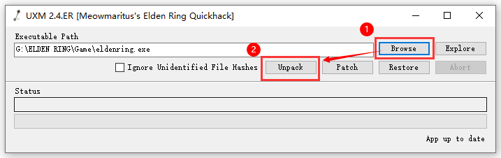

解包出来的游戏文件具有一定的目录结构

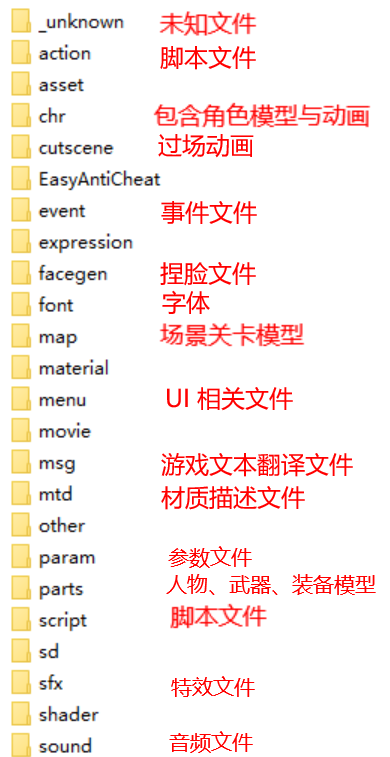

解包出来的文件还需要yabber进行进一步的解包

#### yabber的使用

如同之前所说的uxm解包出来的文件还需要进一步解包这时候就需要yabber 

yabber会将dcx进行解包

### 对脚本的解包

1. 首先使用uxm解包本体文件
2. 再找到script文件夹其中有很多的dcx文件
  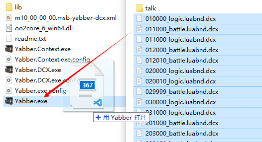
3. 再使用yabber解包dcx 会得到 .lua .luagnl .luainfo 三份文件
4. 我们需要使用dslua进行反编译

### 解包人物模型

注意虽然虽然几乎所有uxm文件夹中的文件都是dcx 但是他们被yabber解包出来的文件是不同的

比如之前的脚本就是解压出来 .lua .luagnl .luainfo 三份文件 

而地图和人物会解压出flvre文件

  脚本文件解包

找到 script 文件夹，将所有 .dcx 文件选中后拖拽至 Yabber 上  

现在每一份 .dcx 文件都被提取出了 .lua .luagnl .luainfo 三份文件，我们将所有 .lua 文件复制出来放到一个文件夹内

接下来需要对 .lua 文件进行反编译，将 .lua 文件默认打开方式改为 DSLuaDecompiler.exe ，在 DSLua 文件夹下即可找到，反编译后的文件名末位会出现 .dec 字段，现在修改打开方式为你的 IDE 工具便可以查看脚本源码

通过查看 goal\_list.dec 文件可以找到对应的脚本编号

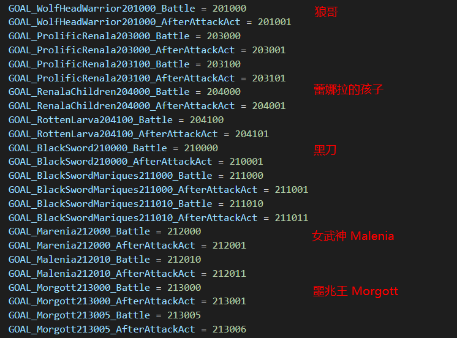

## 解包场景模型

找到 map 文件夹，里面 m10、m11、m12... 中包含地图关卡模型，目前未找到编号与关卡的对应表，只能逐个测试  
我们打开 m10 → m10\_00\_00\_00，这里包含了史东薇尔城的相关模型，将所有 .mapbnd.dcx 拖拽到 Yabber 工具上进行解包

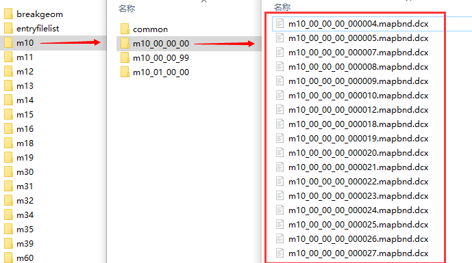

每个 .dcx 都提取出了 .flver 与 .grass 文件，我们将所有 .flver 文件复制到一个新文件夹下，将 .flver 文件默认打开方式改为 BloodBorne\_model\_v3.exe，在 BloodborneToolsByDaemon 文件夹下可以找到

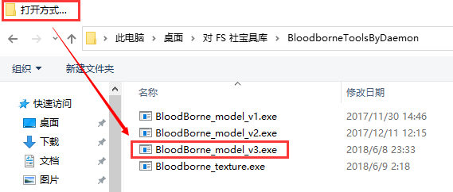

再将 Flver2Smd&Ascii.bat 文件复制到刚才新文件夹的根目录下，运行该文件对 .flver 文件进行批处理

现在我们通过 .flver 获得到了一份 .smd 文件，一份 . ascii 文件

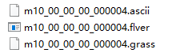

打开 Noesis.exe 应用，将 .flver 转为我们引擎可以使用的 .fbx 格式  
找到刚才新文件夹的根目录，点击 Tools → Batch Process 进行格式转换  
这里点击 FLVER 文件可以预览模型，但会出现下图中线条乱飞的情况，选择 ASCII 格式的文件可以看到修复后的效果

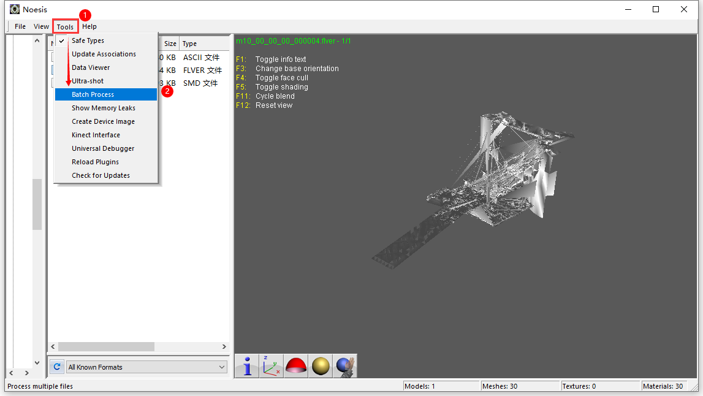

将输出格式改为 fbx，点击 Folder batch 选择输出路径，最后点击 Export 进行导出

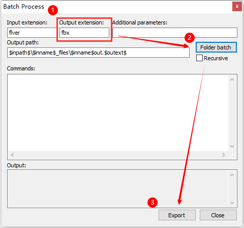

现在我们获取到了 .fbx 格式的文件，导入到引擎中看一下效果

## 解包角色动画

打开 DS ANIM STUDIO.exe（在 PATREON\_DSAS\_4.0.1.1\_BETA 文件夹下），确保软件版本在 4.0 及以上，运行环境需要 **.NET 5.0**

点击 File → Open ，找到本体解包后目录下的 chr ，打开任一后缀为 .anibnd.dcx 的文件，确保前面仅有 c0000 数字组合，如：c2010.anibnd.dcx

通过查看 goal\_list.dec 文件中前四位数字可以找到对应角色动画

打开 .anibnd.dcx 后会提示我们选择模型文件，我们找到相同编号的 .chrbnd.dcx 文件

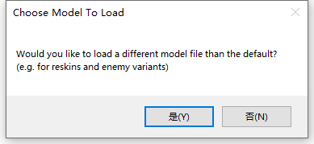

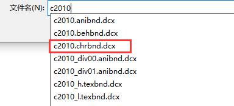

现在可以在 DS ANIM STUDIO 中看到动画事件并可以直接进行编辑

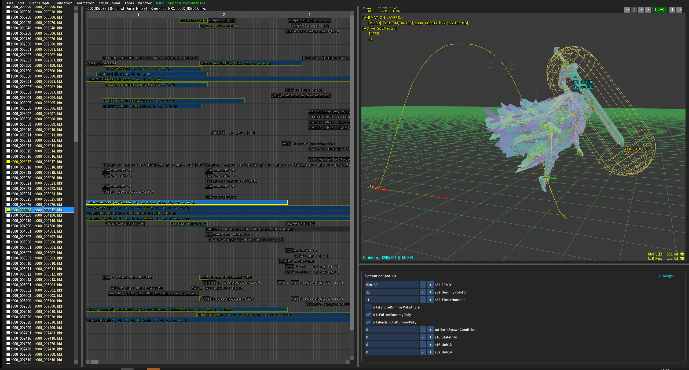

### 将动画格式转为 fbx 的方法

由于老头环导出的动画文件为 havok 2018 版本，目前插件并不支持导入，需要降版本至 2014 及以下才能导入  
最新的 DSAnim 4.1 版本加入了降版本工具，可以将动画将至 2010.2 的 .hkx 文件

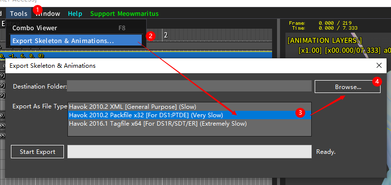

使用 3DMax 导入插件，在 3DMax 中进行格式转换

> 插件地址：[https://github.com/PredatorCZ/HavokMax](https://github.com/PredatorCZ/HavokMax) 插件安装方法：将下载好的 .dlu  
> 文件放置在根目录下的 Plugins 文件夹内后重启软件即可

在 3DMax 中选择 File → Import → Import，找到 skeleton.hkx 骨骼文件打开

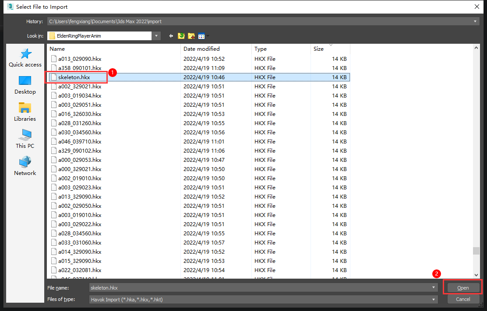

导入轴向按照下图所示

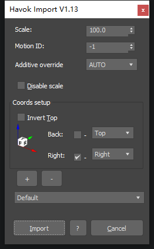

现在已经导入了我们的骨骼，接下来按照相同的流程，导入 .hkx 的动画文件，具体动画对应可以在 DSAnim 中进行预览

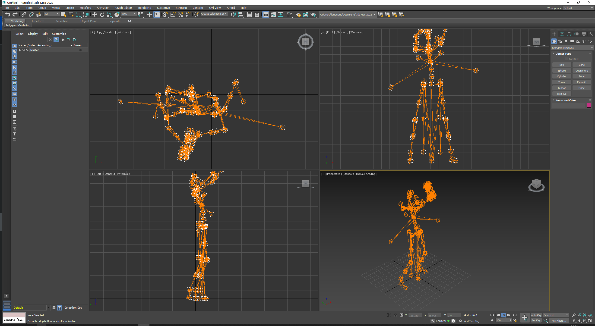

导出时选择：File → Export → Export ，选择想要的格式导出即可  
由于没有导入模型，想要在引擎中看到表现效果需要自行蒙皮或重定向

